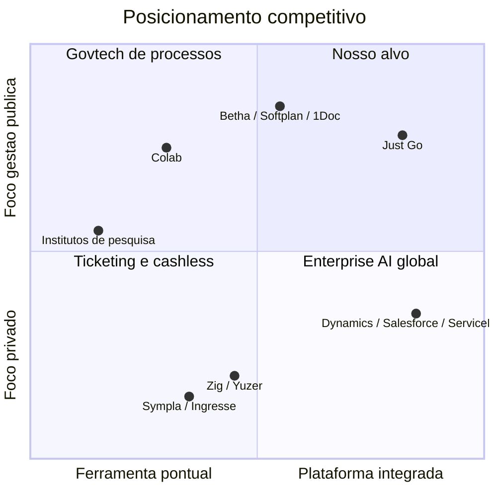
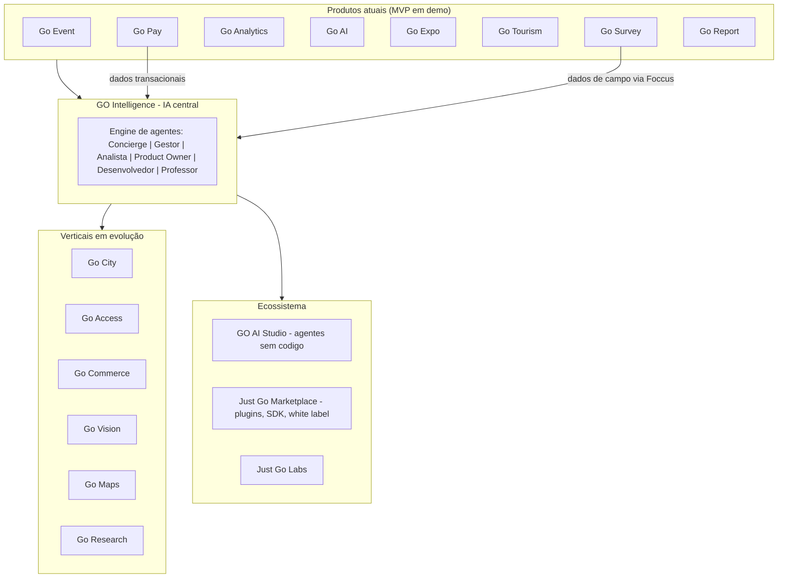

# Documento de Visão — Just Go Intelligence Platform

**Empresa:** Just Go Smart Access
**Fundador:** Daniel Steinbruch
**Parceira técnica exclusiva de pesquisas:** Foccus Pesquisas
**Versão:** 1.0 | **Data:** Julho/2026
**Status do produto:** MVP funcional publicado (landing-demo + app do visitante) em https://danielsmartaccess.github.io/justgo-demo/

---

## Sumário

1. [Visão e Missão](#1-visão-e-missão)
2. [O Problema](#2-o-problema)
3. [A Oportunidade de Mercado (TAM/SAM/SOM)](#3-a-oportunidade-de-mercado-tamsamsom)
4. [Proposta de Valor por Stakeholder](#4-proposta-de-valor-por-stakeholder)
5. [Prova Real: Caso Festival Canaã Cidade Junina](#5-prova-real-caso-festival-canaã-cidade-junina)
6. [Diferenciais Competitivos](#6-diferenciais-competitivos)
7. [Análise Competitiva](#7-análise-competitiva)
8. [Posicionamento: Decision Intelligence](#8-posicionamento-decision-intelligence)
9. [Arquitetura da Visão de Plataforma](#9-arquitetura-da-visão-de-plataforma)
10. [Princípios de Produto](#10-princípios-de-produto)
11. [Riscos e Mitigação](#11-riscos-e-mitigação)
12. [Critérios de Sucesso — 12 e 24 meses](#12-critérios-de-sucesso--12-e-24-meses)

---

## 1. Visão e Missão

### Visão

> **Ser o sistema operacional de inteligência de decisão para cidades, eventos e turismo no Brasil** — a plataforma que transforma cada evento público, cada fluxo de visitantes e cada real movimentado em evidência auditável e em decisão melhor.

Em 5 anos, queremos que nenhuma prefeitura brasileira invista em um evento público sem conseguir responder, com dados auditáveis: *quanto custou, quanto retornou, quem foi beneficiado e o que melhorar na próxima edição*.

### Missão

Transformar conhecimento, dados e tecnologia em resultados concretos para gestores públicos, organizadores de eventos, comerciantes e cidadãos — com IA aplicada, pesquisa de campo rigorosa e evidências que resistem ao escrutínio dos órgãos de controle.

### Tese em uma frase

**Eventos públicos são a maior despesa discricionária sem medição das prefeituras brasileiras. A Just Go transforma essa caixa-preta em ativo de dados auditável — e usa essa cunha para se tornar a plataforma de Decision Intelligence das cidades.**

---

## 2. O Problema

### 2.1 O problema do gestor público

Prefeituras brasileiras investem somas relevantes em festivais, festas juninas, carnavais, aniversários de cidade e eventos de turismo. Na grande maioria dos municípios:

- **Não há medição de impacto econômico.** O gestor não sabe se o evento de R$ 2 milhões gerou R$ 5 milhões ou R$ 500 mil de retorno para a economia local.
- **Não há evidência de satisfação.** A percepção do munícipe é anedótica ("o povo gostou"), não mensurada.
- **Não há rastreabilidade financeira.** Dinheiro circula em espécie dentro do evento, sem visibilidade de arrecadação, sem dados para o comércio local e sem trilha de auditoria.
- **A prestação de contas é frágil.** Órgãos de controle cobram cada vez mais justificativa técnica para gastos com eventos. Sem dados, o gestor responde com narrativa — e narrativa não sustenta defesa técnica.

### 2.2 O problema do organizador de eventos

Organizadores privados (feiras, festivais, arenas, congressos) operam com ferramentas fragmentadas: ticketing de um fornecedor, credenciamento de outro, pesquisa de satisfação improvisada (quando existe), cashless de um terceiro, e nenhuma camada que integre tudo em inteligência de decisão.

### 2.3 O problema do comércio local e do cidadão

- O comerciante não sabe se vale a pena montar barraca, contratar equipe extra ou estocar produto — decide no escuro.
- O morador convive com os custos do evento (trânsito, ruído, gasto público) sem visibilidade do benefício.
- O expositor não tem dados de fluxo, perfil de público e conversão para justificar o investimento no estande.

### 2.4 Por que agora

| Vetor | Evidência |
| --- | --- |
| Pressão por accountability | Órgãos de controle intensificaram a cobrança de justificativa técnica e prestação de contas sobre gastos com eventos públicos |
| Maturidade digital municipal | Pix, GovBR e digitalização de serviços elevaram a régua de expectativa digital nos municípios |
| IA generativa acessível | Custo de construir agentes de IA especializados caiu ordens de magnitude entre 2023 e 2026 |
| Economia de eventos aquecida | Eventos, turismo e economia criativa voltaram a ser prioridade de secretarias de desenvolvimento pós-pandemia |
| Cashless mainstream | O público brasileiro já opera naturalmente com pagamento digital; a resistência ao cashless em eventos caiu |

---

## 3. A Oportunidade de Mercado (TAM/SAM/SOM)

> **Nota metodológica:** os números abaixo são **estimativas construídas a partir de premissas explícitas**, não dados oficiais consolidados. Cada valor deve ser lido junto com sua premissa. Recomenda-se validação com dados primários (IBGE/MUNIC, CNM, ABEOC, ABRAPE) antes de uso em material definitivo de captação.

### 3.1 TAM — Mercado Total Endereçável (Brasil)

**Definição:** gasto anual endereçável com tecnologia, medição, pesquisa e meios de pagamento para eventos públicos e privados + camada smart city/turismo de dados no Brasil.

| Segmento | Premissas | Estimativa anual |
| --- | --- | --- |
| Prefeituras — tecnologia e medição de eventos/turismo | 5.570 municípios; ~70% realizam ao menos 1 evento público relevante/ano (~3.900); ticket médio endereçável de R$ 60 mil/ano (software + medição + pesquisa) | ~R$ 234 mi |
| Eventos privados (feiras, festivais, congressos, arenas) | ~15 mil eventos/ano de porte médio-grande com orçamento de tecnologia; ticket endereçável médio R$ 50 mil | ~R$ 750 mi |
| Cashless / pagamentos em eventos (take-rate endereçável) | Volume transacionado em eventos estimado em R$ 30 bi/ano; captura endereçável de intermediação ~1,5% | ~R$ 450 mi |
| Pesquisa de mercado aplicada a eventos, turismo e gestão pública municipal | Fração endereçável do mercado brasileiro de pesquisa dedicada a estes usos | ~R$ 200 mi |
| Smart city / plataformas de dados municipais (fração eventos-turismo-gestão) | Fração endereçável do orçamento municipal de TI voltado a dados e inteligência | ~R$ 400 mi |
| **TAM total estimado** | | **~R$ 2,0 bi/ano** |

### 3.2 SAM — Mercado Endereçável pela Just Go (horizonte 3-5 anos)

**Filtros aplicados sobre o TAM:**

- Municípios de 20 mil a 500 mil habitantes com calendário anual de eventos (festas juninas, festivais, aniversário de cidade) — ~1.700 municípios;
- Eventos privados de 3 mil a 100 mil visitantes nas regiões Sul, Sudeste e Nordeste;
- Vertical de pesquisa via parceria exclusiva com a Foccus Pesquisas.

| Segmento | Premissas | Estimativa anual |
| --- | --- | --- |
| Prefeituras-alvo | 1.700 municípios × ticket médio anual R$ 75 mil (implantação amortizada + SaaS + 1 pesquisa) | ~R$ 128 mi |
| Eventos privados-alvo | 3.000 eventos × ticket médio R$ 55 mil | ~R$ 165 mi |
| Go Pay (take-rate sobre GMV endereçável) | GMV endereçável R$ 4 bi × captura 1,3% | ~R$ 52 mi |
| Pesquisas e relatórios (com Foccus) | 800 projetos/ano endereçáveis × R$ 25 mil médio | ~R$ 20 mi |
| **SAM total estimado** | | **~R$ 365 mi/ano** |

### 3.3 SOM — Mercado Capturável (24 meses, até jul/2028)

**Premissas de captura:** capacidade comercial de uma equipe enxuta (fundador + 2-4 pessoas de vendas/CS até 2028), ciclo de venda pública de 4-9 meses, foco geográfico inicial (estado-sede e vizinhos), efeito-vitrine do caso Canaã.

| Cenário | Clientes ativos em 24 meses | Receita anualizada estimada |
| --- | --- | --- |
| Conservador | 12 prefeituras + 8 eventos privados | ~R$ 1,8 mi/ano |
| Base | 25 prefeituras + 18 eventos privados + Go Pay em 10 eventos | ~R$ 4,2 mi/ano |
| Otimista | 45 prefeituras + 35 eventos privados + Go Pay escalado + 2 contratos enterprise | ~R$ 9,5 mi/ano |

**SOM base: ~R$ 4,2 mi/ano ao final de 24 meses (~1,2% do SAM)** — penetração deliberadamente modesta, coerente com venda B2G de ciclo longo e equipe enxuta.

---

## 4. Proposta de Valor por Stakeholder

| Stakeholder | Dor central | Proposta de valor Just Go | Evidência entregue |
| --- | --- | --- | --- |
| **Prefeito / Gestor municipal** | Investe em eventos sem conseguir provar retorno; exposição perante órgãos de controle | Evidência auditável de impacto econômico, satisfação e arrecadação; narrativa política baseada em dados | Relatório executivo com metodologia declarada, amostragem e margem de erro |
| **Órgãos de controle** | Prestação de contas de eventos sem lastro técnico | Trilha de dados padronizada, metodologia de pesquisa documentada, rastreabilidade financeira via Go Pay | Dossiê técnico auditável por edição de evento |
| **Secretarias (Turismo, Cultura, Desenvolvimento)** | Planejam edições futuras sem série histórica | Séries históricas comparáveis, segmentação de público, benchmark entre eventos | Dashboards Go Analytics + Go Report |
| **Organizador de evento privado** | Stack fragmentado, sem inteligência integrada | Plataforma única: app, credenciamento, pesquisa, cashless, analytics | ROI por área do evento, NPS em tempo real |
| **Comércio local** | Decide investimento no escuro | Previsão de fluxo, perfil de público, dados de vendas cashless por segmento | Painel do comerciante + cashback/fidelidade (Go Commerce) |
| **Expositor / Patrocinador** | Não consegue provar retorno do estande/cota | Métricas de fluxo, leads, conversão e exposição de marca | Relatório de performance do expositor (Go Expo) |
| **Morador / Visitante** | Custo do evento sem visibilidade de benefício; experiência analógica | App do evento (mapa, programação, serviços), voz via pesquisa, pagamentos ágeis | Go Event + participação nas pesquisas |
| **Foccus Pesquisas (parceira)** | Escalar operação de campo com tecnologia | Plataforma offline-first que multiplica produtividade dos entrevistadores e padroniza qualidade | Go Survey + Go Research |

---

## 5. Prova Real: Caso Festival Canaã Cidade Junina

O único slide que investidor não pode contestar é o que já aconteceu.

| Indicador | Resultado |
| --- | --- |
| Entrevistas realizadas | **1.647**, 100% digitais |
| Segmentos pesquisados | 530 visitantes, 413 moradores, 253 comerciantes, 118 expositores |
| Impacto econômico medido | **R$ 8,2 milhões** |
| Satisfação geral | **94%** |
| Operação | Coleta offline-first em campo, com a Foccus Pesquisas |

**O que o caso prova:**

1. **Viabilidade operacional** — a metodologia funciona em campo real, com escala de mais de 1,6 mil entrevistas em um único evento.
2. **Valor multissetorial** — quatro stakeholders distintos medidos no mesmo projeto (visitante, morador, comerciante, expositor).
3. **Produto de saída claro** — o número "R$ 8,2 mi de impacto" virou ativo político e de prestação de contas para a gestão municipal.
4. **Motor de replicação** — todo município com festa junina relevante é um comprador natural do mesmo pacote.

---

## 6. Diferenciais Competitivos

| # | Diferencial | Por que é defensável |
| --- | --- | --- |
| 1 | **Cunha regulatória**: prestação de contas para órgãos de controle como gatilho de compra | Concorrentes de ticketing/eventos vendem experiência; nós vendemos defesa técnica do gasto público — motivador de compra mais forte em B2G |
| 2 | **Pesquisa de campo real com parceira exclusiva (Foccus)** | Software sozinho não entrevista morador e comerciante; a operação híbrida (tech + campo) é difícil de replicar por players puramente SaaS |
| 3 | **Caso comprovado com números auditáveis** | 1.647 entrevistas e R$ 8,2 mi medidos criam prova social específica do segmento, não genérica |
| 4 | **Plataforma integrada evento→cidade** | O mesmo dado coletado no evento alimenta turismo, comércio e planejamento urbano — aumenta switching cost a cada módulo ativado |
| 5 | **Go Pay como camada de verdade financeira** | Cashless centralizado dá à gestão visibilidade da economia real do evento e cria receita transacional recorrente para a plataforma |
| 6 | **IA aplicada ao contexto brasileiro de gestão municipal** | Agentes especializados (Gestor, Analista, Concierge) treinados no vocabulário e nos ritos da administração pública brasileira |
| 7 | **Custo de servir baixo (offline-first, mobile-first)** | Funciona em cidade do interior com conectividade precária — onde os concorrentes enterprise não conseguem operar |

---

## 7. Análise Competitiva

### 7.1 Mapa de concorrentes

| Categoria | Players (exemplos) | O que fazem bem | Onde não competem conosco |
| --- | --- | --- | --- |
| **Ticketing / gestão de eventos (nacional)** | Sympla, Ingresse, Eventbrite Brasil, Even3, E-Inscrição | Venda de ingressos, inscrição, credenciamento | Não medem impacto econômico, não fazem pesquisa de campo, não atendem a lógica de prestação de contas B2G |
| **Cashless em eventos** | Zig (ZigPay), Yuzer, TagMe/soluções de arenas | Operação cashless em bares, festivais e arenas | Foco em operação de consumo privado; não entregam camada de inteligência para gestão pública nem pesquisa |
| **Pesquisa de mercado tradicional** | Institutos regionais e nacionais de pesquisa | Rigor metodológico, credibilidade | Operação manual, cara, sem plataforma de software, sem recorrência SaaS, sem integração com dados transacionais |
| **BI / Analytics genérico** | Power BI, Qlik, Tableau, Metabase (via consultorias) | Visualização e modelagem de dados | Ferramenta, não solução: exigem que a prefeitura tenha dados — que é exatamente o que falta |
| **Smart city / govtech (nacional)** | Colab, 1Doc, Softplan, Betha, IPM | Processos administrativos, zeladoria, participação cidadã | Não cobrem economia de eventos, turismo de dados nem medição de impacto; são sistemas de registro, não de decisão |
| **Plataformas enterprise com IA (internacional)** | Microsoft Dynamics + Copilot, Salesforce + Agentforce, ServiceNow AI | Categoria de referência em Decision/Agentic AI | Preço e complexidade incompatíveis com município médio brasileiro; sem operação de campo; sem contexto local |
| **Turismo de dados** | Observatórios de turismo estaduais, consultorias ad hoc | Estudos setoriais pontuais | Sem produto, sem recorrência, sem tempo real |

### 7.2 Leitura estratégica

- **Ninguém ocupa a interseção** *evento público × pesquisa de campo × cashless × prestação de contas × IA*. Cada concorrente cobre uma fatia; a Just Go integra as fatias em um único fluxo de valor.
- **O concorrente real no curto prazo é o status quo**: a prefeitura que não mede nada e o organizador que improvisa. A venda é de categoria nova, não de substituição — isso exige educação de mercado (risco tratado na seção 11).
- **Os players enterprise internacionais validam a categoria** (Decision Intelligence / agentes de IA aplicados à operação), mas não descerão ao município de 80 mil habitantes no interior do Brasil. Essa é a nossa geografia defensável.

### 7.3 Posição relativa

---

## 8. Posicionamento: Decision Intelligence

### 8.1 Declaração de posicionamento

> Para **prefeituras e organizadores de eventos** que precisam **provar e melhorar o retorno de cada evento e de cada política de turismo**, a **Just Go Intelligence Platform** é uma **Decision Intelligence Platform** que **transforma dados de campo, pagamentos e comportamento em evidências auditáveis e recomendações acionáveis** — diferentemente de **ticketing, cashless ou BI isolados**, que entregam operação ou gráficos, mas não decisão.

### 8.2 A escada de categoria

| Nível | Categoria | O que entrega | Onde estamos |
| --- | --- | --- | --- |
| 1 | Ferramentas de evento | Ingresso, credencial, app | Coberto (Go Event, Go Expo) |
| 2 | Dados | Pesquisa, transações, fluxo | Coberto e comprovado (Go Survey, Go Pay, caso Canaã) |
| 3 | Analytics | Dashboards, relatórios | Coberto (Go Analytics, Go Report) |
| 4 | **Decision Intelligence** | Recomendações, simulações, agentes que agem | Em construção (GO Intelligence + agentes) — **é aqui que fincamos a bandeira** |
| 5 | Sistema operacional da cidade | Verticais integradas (Go City, Go Commerce, Go Access, Go Vision) | Visão 2027+ |

### 8.3 Analogia de mercado (uso interno e com investidores)

Assim como **Dynamics + Copilot**, **Salesforce + Agentforce** e **ServiceNow AI** acoplaram agentes de IA a plataformas de operação empresarial, a Just Go acopla o **GO Intelligence** (IA central + engine de agentes) à operação de **eventos, cidades e turismo no contexto brasileiro** — um território que os globais não alcançam por preço, idioma institucional e ausência de operação de campo.

---

## 9. Arquitetura da Visão de Plataforma

**Sequência de construção (disciplina de foco):**

1. **Hoje → 12 meses:** Event Intelligence para prefeituras (Go Event + Go Survey + Go Pay + Go Report) como cunha. Nada de dispersão.
2. **12 → 24 meses:** GO Intelligence v1 (agentes Analista e Gestor sobre a base de dados acumulada) + Go Commerce nas cidades já clientes.
3. **24+ meses:** GO AI Studio, Marketplace, verticais Go City / Go Access / Go Vision, expansão para hotelaria, estacionamentos e edifícios.

---

## 10. Princípios de Produto

1. **Evidência antes de opinião.** Todo número exibido carrega metodologia, amostra e limitação. Se não é auditável, não vai para o relatório.
2. **Offline-first é inegociável.** O produto precisa funcionar na praça da cidade do interior sem sinal — porque é lá que o cliente está.
3. **O relatório é o produto.** O gestor não compra dashboard; compra o documento que ele entrega ao órgão de controle e apresenta à câmara. Tudo converge para o Go Report.
4. **Cada módulo se paga sozinho, e a plataforma multiplica.** Nenhum módulo depende de outro para gerar valor, mas cada módulo adicional aumenta o valor dos demais (dados compartilhados).
5. **IA com responsabilidade declarada.** Agentes recomendam e explicam; a decisão pública é sempre humana e registrada. Vieses e limitações são documentados por padrão.
6. **Simplicidade radical na ponta.** Entrevistador, comerciante e visitante usam o produto sem treinamento. Complexidade fica no back-end.
7. **Dados do município pertencem ao município.** Portabilidade e exportação garantidas em contrato — confiança é pré-requisito de venda B2G.
8. **Construir sobre o que já foi vendido.** Roadmap orientado por contratos e dores reais de clientes ativos, não por fascínio tecnológico.

---

## 11. Riscos e Mitigação

| # | Risco | Prob. | Impacto | Mitigação |
| --- | --- | --- | --- | --- |
| 1 | **Ciclo de venda pública longo** (orçamento, licitação, calendário eleitoral) | Alta | Alto | Mix B2G + B2B privado; entrada por dispensa por valor e ata de registro de preços; venda casada com o calendário de eventos (decisão 4-6 meses antes do evento) |
| 2 | **Dependência do fundador** (venda, produto e entrega concentrados) | Alta | Alto | Playbook de implantação documentado; parceria Foccus absorve operação de campo; primeira contratação comercial no mês 6-9 |
| 3 | **Dependência de parceiro único de pesquisa (Foccus)** | Média | Alto | Contrato de exclusividade com SLAs bilaterais; padronização metodológica dentro do Go Survey/Go Research para reduzir dependência de pessoas específicas |
| 4 | **Descontinuidade política** (troca de gestão municipal descontinua contrato) | Alta | Médio | Ancorar valor nos órgãos de controle e na burocracia técnica (secretarias), que permanecem; séries históricas criam custo de descontinuar; contratos plurianuais quando possível |
| 5 | **Big techs ou govtechs incumbentes entram no nicho** | Baixa-média | Alto | Velocidade + operação de campo + base de dados proprietária de eventos; incumbentes de processos (Betha, Softplan) são potenciais canais/parceiros antes de serem ameaças |
| 6 | **Risco regulatório de pagamentos (Go Pay)** | Média | Médio | Operar como camada sobre instituição de pagamento licenciada (modelo de parceria/white label de adquirência), não como instituição própria no início |
| 7 | **LGPD e dados sensíveis de cidadãos** | Média | Alto | Anonimização por padrão, minimização de coleta, DPO designado, relatórios sempre agregados; conformidade LGPD como argumento de venda, não custo |
| 8 | **Estimativas de impacto econômico contestadas tecnicamente** | Média | Alto | Metodologia assinada com a Foccus, premissas publicadas em todo relatório, revisão por par externo em projetos de alta visibilidade |
| 9 | **Dispersão de portfólio** (visão ampla demais para equipe enxuta) | Alta | Médio | Disciplina da seção 9: apenas a cunha Event Intelligence até validar 20+ clientes; roadmap trimestral com critérios de entrada/saída |
| 10 | **Inadimplência / atraso de pagamento do setor público** | Média | Médio | Preferência por empenho prévio, implantação faturada no início, mix ≥40% de receita privada no médio prazo |

---

## 12. Critérios de Sucesso — 12 e 24 meses

### 12.1 Horizonte 12 meses (julho/2027)

| Dimensão | Meta | Métrica de verificação |
| --- | --- | --- |
| Comercial | 8-12 clientes pagantes (mín. 5 prefeituras) | Contratos assinados / empenhos |
| Receita | R$ 900 mil - 1,4 mi de receita reconhecida no período | Faturamento |
| Recorrência | MRR ≥ R$ 35 mil ao final do mês 12 | MRR contratado |
| Produto | Go Event + Go Survey + Go Report em produção multi-cliente; Go Pay piloto em 2 eventos | Releases + eventos operados |
| Prova de valor | 3 novos casos documentados no padrão Canaã (impacto + satisfação + dossiê para órgãos de controle) | Relatórios publicados |
| Operação | Playbook de implantação executável sem o fundador em campo | Implantação-teste conduzida por terceiro |
| Parceria | Contrato formal de exclusividade e SLA com a Foccus | Contrato vigente |

### 12.2 Horizonte 24 meses (julho/2028)

| Dimensão | Meta | Métrica de verificação |
| --- | --- | --- |
| Comercial | 25-45 clientes ativos; presença em ≥3 estados | CRM / contratos |
| Receita | Receita anualizada R$ 3,5 - 9,5 mi (cenários base-otimista) | Faturamento anualizado |
| Recorrência | MRR ≥ R$ 120 mil; NRR ≥ 110% | MRR / NRR |
| Go Pay | ≥ 15 eventos operados; GMV ≥ R$ 25 mi acumulado | GMV / take-rate realizado |
| Plataforma | GO Intelligence v1 em produção (agentes Analista e Gestor); primeiro plugin de terceiro no Marketplace | Release + parceiro publicado |
| Dados | Maior base estruturada de impacto de eventos municipais do Brasil (≥ 60 eventos medidos) | Base de dados |
| Time | 6-10 pessoas; fundador fora da rotina de entrega | Organograma |
| Captação (se aplicável) | Seed levantado com métricas acima, ou operação cash-flow positive | Term sheet / DRE |

### 12.3 Sinais de alerta (kill/pivot criteria)

- Menos de 4 clientes pagantes em 12 meses → rever ICP e canal antes de investir em plataforma.
- Churn de prefeituras pós-troca de gestão > 50% → reforçar ancoragem em órgãos de controle e contratos plurianuais, ou repriorizar B2B privado.
- CAC B2G > 18 meses de payback de forma persistente → migrar ênfase para canal indireto (consultorias, associações municipalistas).

---

*Documento elaborado pela Just Go Smart Access — julho/2026. Estimativas de mercado baseadas em premissas explícitas declaradas na seção 3; sujeitas a revisão com dados primários.*
