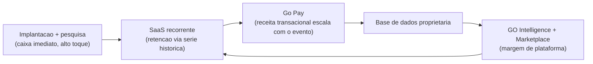

# Business Model Canvas — Just Go Intelligence Platform

**Empresa:** Just Go Smart Access | **Fundador:** Daniel Steinbruch
**Parceira técnica exclusiva de pesquisas:** Foccus Pesquisas
**Versão:** 1.0 | **Data:** Julho/2026

---

## Canvas Resumido (visão em uma tabela)

| Bloco | Síntese |
| --- | --- |
| **1. Segmentos de Clientes** | Prefeituras e secretarias (turismo, cultura, desenvolvimento); organizadores de eventos, feiras, festivais, arenas e congressos; 2º momento: hotelaria, estacionamentos, edifícios |
| **2. Proposta de Valor** | Evidência auditável de impacto econômico, satisfação e arrecadação de eventos — pronta para prestação de contas aos órgãos de controle — mais operação integrada (app, pesquisa, cashless, analytics) e inteligência de decisão com IA |
| **3. Canais** | Venda direta consultiva do fundador; parceria Foccus; efeito-vitrine de casos (Canaã); associações municipalistas e eventos do setor público; landing-demo pública |
| **4. Relacionamento** | Alto toque na implantação (projeto), sucesso do cliente contínuo no SaaS, relatórios executivos por edição de evento, comunidade de gestores |
| **5. Fontes de Receita** | Projetos de implantação (R$ 18-350 mil); SaaS (R$ 990 a R$ 4.990/mês); pesquisas avulsas (~R$ 18 mil) e relatórios (~R$ 15 mil); take-rate Go Pay; futuramente marketplace, APIs e white label |
| **6. Recursos-Chave** | Plataforma Just Go (MVP publicado); metodologia de medição validada; base de dados proprietária de eventos; marca/caso Canaã; parceria Foccus; conhecimento do rito público |
| **7. Atividades-Chave** | Desenvolvimento de produto e IA; venda consultiva B2G/B2B; operação de pesquisas com a Foccus; implantação de eventos; produção de relatórios auditáveis |
| **8. Parcerias-Chave** | Foccus Pesquisas (exclusiva em pesquisa); instituição de pagamento licenciada (Go Pay); cloud (Google/Firebase); futuras: govtechs incumbentes como canal, associações de municípios |
| **9. Estrutura de Custos** | Time enxuto (produto + comercial); cloud e IA (custo variável baixo); custo de campo repassado/compartilhado com Foccus; custo comercial B2G (deslocamento, ciclo longo) |

---

## 1. Segmentos de Clientes

**Quem pagará e por quê.**

### Segmento primário (cunha de entrada): Prefeituras e secretarias

- **Perfil:** municípios de 20 mil a 500 mil habitantes com calendário anual de eventos (festas juninas, festivais, aniversários de cidade, eventos de turismo).
- **Comprador econômico:** prefeito e secretário (turismo, cultura ou desenvolvimento econômico).
- **Gatilho de compra:** necessidade de prestar contas do gasto com eventos aos órgãos de controle e de justificar politicamente o investimento.
- **Exemplo concreto:** a gestão que realizou o Festival Canaã Cidade Junina passou a dispor de impacto econômico medido de R$ 8,2 mi e satisfação de 94% como evidência de resultado — este é o pacote replicável.

### Segmento secundário: Organizadores privados

- Feiras de negócios, festivais culturais, arenas, congressos com 3 mil a 100 mil visitantes.
- **Gatilho:** provar ROI a patrocinadores e expositores (Go Expo) e unificar stack fragmentado.

### Segundo momento (2027+): Hotelaria, estacionamentos, edifícios

- Reuso direto de Go Access (controle de acesso/portarias), Go Pay e Go Analytics em fluxos contínuos de pessoas — expansão sem reescrever o núcleo.

**Justificativa da ordem:** o B2G tem ciclo mais longo, porém ticket maior, menor concorrência direta e um comprador com dor regulatória aguda; o caso Canaã dá prova social exatamente neste segmento.

---

## 2. Proposta de Valor

**O que resolve, para quem, com que prova.**

| Cliente | Valor central | Exemplo concreto |
| --- | --- | --- |
| Prefeito/secretário | Evidência auditável para órgãos de controle + narrativa política com dados | Dossiê do evento: impacto econômico, satisfação, arrecadação cashless, metodologia declarada |
| Organizador privado | Plataforma única + prova de ROI para patrocinador | Relatório de performance por expositor (fluxo, leads, conversão) |
| Comércio local | Decisão informada + fidelização | Previsão de fluxo antes do evento; cashback via Go Commerce depois |
| Visitante/morador | Experiência digital + voz ouvida | Go Event (mapa, programação) + pesquisa que vira melhoria na edição seguinte |

**Elemento diferenciador:** ninguém mais combina software, operação de pesquisa de campo (Foccus) e camada financeira (Go Pay) em um único fluxo que termina em documento de prestação de contas. A concorrência entrega operação **ou** gráficos; a Just Go entrega **decisão defensável**.

---

## 3. Canais

| Canal | Papel | Estágio |
| --- | --- | --- |
| Venda direta consultiva (fundador) | Fechamento de contratos B2G/B2B; diagnóstico → proposta → piloto | Ativo |
| Parceria Foccus Pesquisas | Porta de entrada em prefeituras onde a Foccus já atua; co-venda de pesquisas | Ativo |
| Efeito-vitrine de casos | O relatório do Canaã é a peça comercial nº 1; cada novo caso vira canal | Ativo |
| Landing-demo pública (justgo-demo) | Demonstração autônoma do produto para leads; qualificação | Ativo |
| Associações municipalistas e eventos do setor (marchas de prefeitos, encontros de secretários de turismo) | Escala de geração de leads B2G | Planejado (12 meses) |
| Canal indireto (consultorias de gestão pública, govtechs incumbentes) | Escala além da capacidade comercial própria | Planejado (18-24 meses) |

**Justificativa:** em B2G, confiança e referência valem mais que mídia paga; o funil nasce de caso comprovado + relacionamento, e só depois se industrializa via canal indireto.

---

## 4. Relacionamento com Clientes

- **Implantação de alto toque (projeto):** cada evento é um projeto com plano de medição, treinamento e presença em campo — é aqui que se constrói a confiança B2G.
- **Sucesso do cliente no SaaS:** revisões trimestrais de valor com a secretaria; meta explícita: renovação atrelada ao calendário de eventos do ano seguinte.
- **Relatório executivo por edição:** o Go Report entregue ao gestor é simultaneamente produto e ferramenta de retenção (série histórica cria custo de troca).
- **Comunidade de gestores (futuro):** benchmark anonimizado entre municípios clientes ("seu evento vs. mediana de eventos similares") — efeito de rede de dados.
- **Automação progressiva:** agentes GO Intelligence (Concierge para o visitante, Analista para o gestor) reduzem custo de servir à medida que a base cresce.

**Justificativa:** o modelo começa "consultoria com software" e migra para "software com serviço" — trajetória deliberada para preservar margem sem sacrificar a confiança que o setor público exige.

---

## 5. Fontes de Receita

| Fonte | Mecânica | Referência de preço (jul/2026) |
| --- | --- | --- |
| Projetos de implantação | Por evento/porte: Start (até 5 mil visitantes), Professional (até 20 mil), Enterprise | R$ 18-30 mil / R$ 45-80 mil / R$ 120-350 mil |
| SaaS (assinatura) | Starter / Business / Enterprise, cobrança mensal ou anual | R$ 990 / R$ 2.490 / R$ 4.990 por mês |
| Pesquisa avulsa (com Foccus) | Projeto de pesquisa por evento ou tema | ~R$ 18 mil |
| Relatório executivo | Dossiê de impacto e prestação de contas | ~R$ 15 mil |
| Go Pay (take-rate) | % sobre volume transacionado cashless no evento | Alvo 1,0-1,5% sobre GMV (detalhado no doc. 12-monetizacao) |
| Marketplace (futuro) | Revenue share sobre plugins/apps de terceiros | Alvo 20-30% de comissão |
| APIs públicas (futuro) | Planos por volume de chamadas | Tabelado por faixa |
| White label (futuro) | Licenciamento da plataforma para operadores/consultorias | Setup + royalty mensal |

**Justificativa do mix:** implantação financia o caixa no curto prazo; SaaS constrói valor de empresa (receita recorrente); Go Pay escala com o sucesso do cliente sem esforço comercial adicional; marketplace e APIs monetizam o ecossistema quando houver massa crítica.

---

## 6. Recursos-Chave

| Recurso | Por que é chave | Estado atual |
| --- | --- | --- |
| Plataforma Just Go (código, arquitetura offline-first) | Base de tudo; MVP publicado em produção estática | Demo pública no GitHub Pages |
| Metodologia de medição de impacto | É o que torna o número defensável perante órgãos de controle | Validada no caso Canaã (1.647 entrevistas) |
| Base de dados proprietária de eventos | Ativo composto: cada evento medido melhora benchmarks e treina o GO Intelligence | 1 evento completo; meta 60+ em 24 meses |
| Parceria exclusiva Foccus | Capacidade de campo que software puro não replica | Ativa; formalização contratual em curso |
| Marca e caso Canaã | Prova social específica do segmento | Documentado |
| Conhecimento do rito público (licitação, empenho, prestação de contas) | Reduz ciclo de venda e risco contratual | No fundador; a documentar em playbook |
| Time técnico e de produto | Execução do roadmap GO Intelligence | Enxuto; contratações previstas com receita/captação |

---

## 7. Atividades-Chave

1. **Desenvolvimento de produto:** evolução do MVP para multi-tenant SaaS; módulos Go Pay e GO Intelligence v1. *(stack: Angular/TypeScript no front, Python/FastAPI no back, PostgreSQL, Firebase/Google Cloud)*
2. **Venda consultiva B2G/B2B:** diagnóstico do calendário de eventos do município → proposta com modalidade de contratação adequada (dispensa por valor, ata, licitação).
3. **Operação de pesquisa com a Foccus:** desenho amostral, campo digital offline-first, controle de qualidade, ponderação.
4. **Implantação de eventos:** configuração, treinamento, operação assistida no evento.
5. **Produção de relatórios auditáveis:** análise, redação executiva, dossiê para órgãos de controle — hoje artesanal, progressivamente automatizada pelo Go Report + agente Analista.
6. **Gestão de parcerias:** Foccus, instituição de pagamento (Go Pay), futuros parceiros de canal.

---

## 8. Parcerias-Chave

| Parceiro | Tipo | O que traz | O que recebe |
| --- | --- | --- | --- |
| **Foccus Pesquisas** | Estratégica, exclusiva em pesquisas | Operação de campo, credibilidade metodológica, acesso a prefeituras | Plataforma que multiplica produtividade; participação na receita de pesquisa |
| Instituição de pagamento licenciada | Operacional (Go Pay) | Licença regulatória, adquirência, liquidação | Volume transacionado; split do take-rate |
| Google Cloud / Firebase | Infraestrutura | Escala, credibilidade, eventuais créditos para startups | Consumo de cloud |
| Associações municipalistas | Canal (futuro) | Acesso qualificado a prefeitos e secretários | Conteúdo técnico, benchmark de eventos para associados |
| Govtechs incumbentes (ex.: fornecedores de ERP municipal) | Canal/integração (futuro) | Capilaridade comercial em milhares de municípios | Módulo de eventos/turismo que não possuem |
| Universidades / Just Go Labs | P&D | Validação metodológica independente, talento | Dados para pesquisa aplicada (anonimizados) |

**Justificativa:** a Foccus é a parceria estruturante — converte a Just Go de "mais um SaaS" em operação híbrida tecnologia + campo, difícil de copiar. O parceiro de pagamentos elimina o risco regulatório de operar Go Pay como instituição própria.

---

## 9. Estrutura de Custos

| Categoria | Natureza | Comentário |
| --- | --- | --- |
| Pessoas (produto/engenharia) | Fixo | Maior linha de custo; time enxuto (2-5 pessoas no ano 1) |
| Comercial e marketing B2G | Semi-variável | Deslocamentos, presença em eventos do setor, material de casos; ciclo longo exige fôlego |
| Cloud e IA (inferência) | Variável | Baixo no MVP (estático); cresce com SaaS multi-tenant e agentes — monitorar custo por cliente |
| Operação de campo | Variável, majoritariamente repassado | Custo de entrevistadores dentro do preço da pesquisa, compartilhado com a Foccus |
| Custo de transação Go Pay | Variável | Split com a instituição de pagamento; margem líquida alvo definida no doc. de monetização |
| Administrativo/jurídico | Fixo | Contratos públicos exigem assessoria jurídica recorrente (licitações, atas) |

**Características do modelo de custo:**

- **Alavancagem operacional alta no SaaS:** custo marginal por município adicional é baixo após a plataforma multi-tenant.
- **Serviços (implantação/pesquisa) têm margem menor, mas financiam o CAC** do SaaS — o cliente paga para ser adquirido.
- **Disciplina:** meta de manter custos fixos cobertos pelo MRR a partir do mês 18 (cenário base do doc. 12-monetizacao).

---

## Coerência do modelo (leitura executiva)

O modelo é uma escada: **serviço financia a entrada, assinatura constrói o valor, transação escala sem venda adicional, e dados transformam tudo em plataforma.** Cada degrau já tem preço definido e, no caso do primeiro, cliente real entregue.

---

*Documento elaborado pela Just Go Smart Access — julho/2026. Valores de preço são referências comerciais vigentes; projeções e percentuais-alvo detalhados no documento 12-monetizacao.md.*
