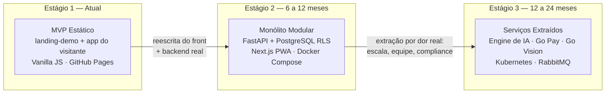
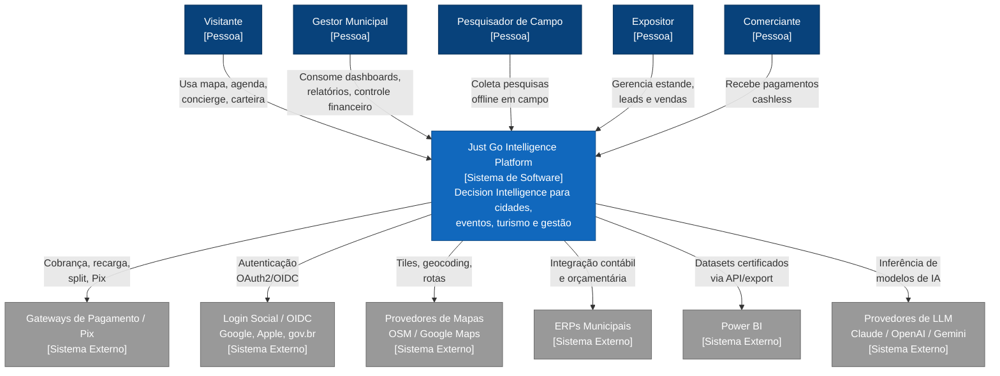
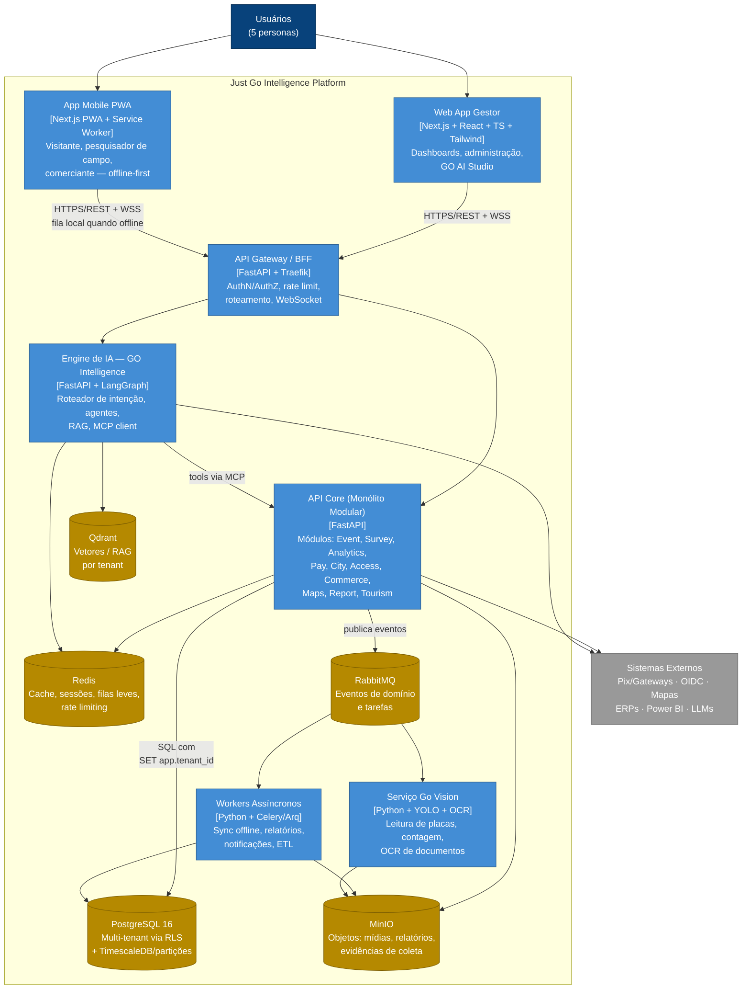
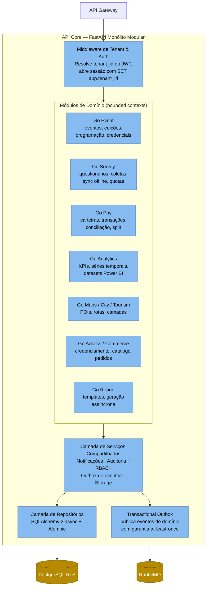
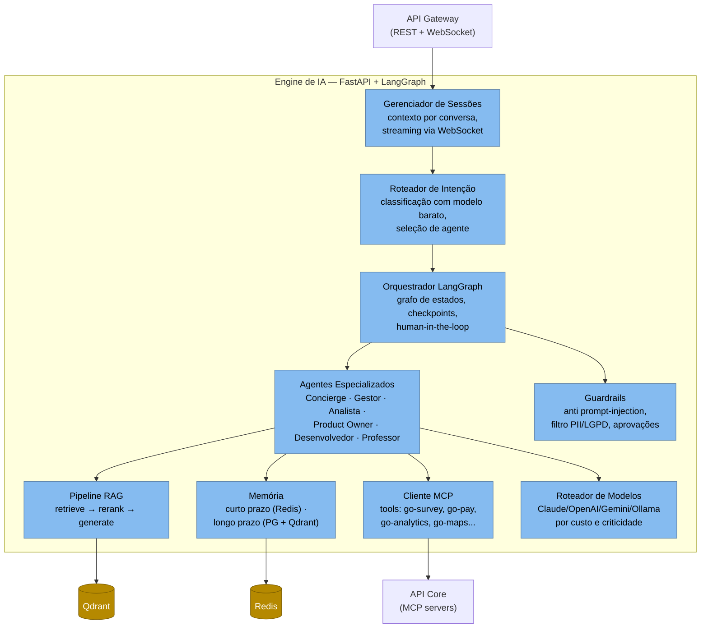
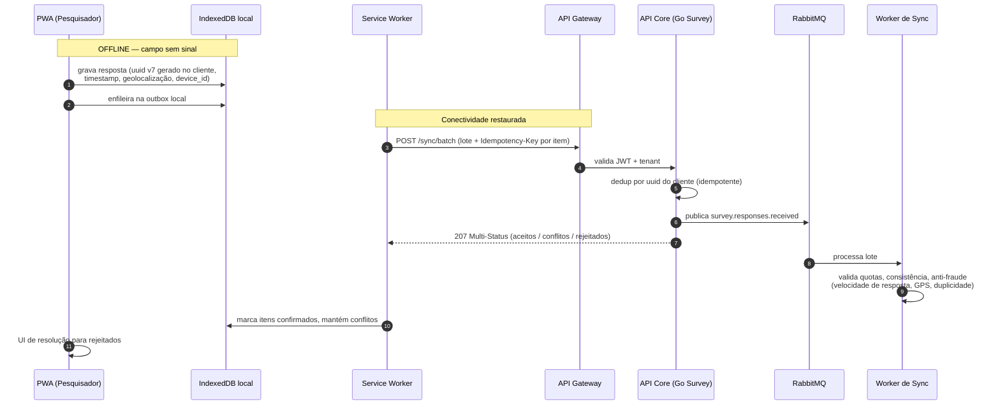
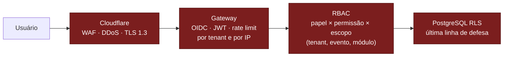

# 04 — Arquitetura de Software (C4 Model)

> **Just Go Intelligence Platform** — Decision Intelligence Platform para cidades inteligentes, eventos, turismo e gestão.
> **Empresa:** Just Go Smart Access · **Fundador:** Daniel Steinbruch
> **Status:** Documento de arquitetura alvo (target architecture) — o estado atual é um MVP estático publicado em `https://danielsmartaccess.github.io/justgo-demo/`.

---

## 1. Visão Geral e Estratégia de Evolução

A plataforma será construída em **3 estágios evolutivos**, evitando o erro clássico de começar por microsserviços sem massa crítica de domínio validado.

| Estágio | Gatilho de transição | O que muda | O que NÃO muda |
|---|---|---|---|
| 1 → 2 | Primeiro cliente pagante (prefeitura/evento) exigindo dados reais, login e coleta offline | Backend FastAPI, PostgreSQL multi-tenant, PWA Next.js | Identidade visual, jornada do visitante validada no MVP |
| 2 → 3 | (a) Engine de IA saturando CPU/GPU do monólito; (b) Go Pay exigindo isolamento por compliance financeiro; (c) Go Vision exigindo GPU dedicada | Extração de 3 serviços: IA, Pagamentos, Visão Computacional | Contratos de API (o gateway preserva rotas), modelo de dados lógico |

**Princípio orientador:** o monólito modular do Estágio 2 já é organizado internamente por *bounded contexts* (Go Event, Go Survey, Go Pay...), de forma que a extração no Estágio 3 seja um recorte de módulos já isolados — não uma reescrita.

---

## 2. Nível 1 — Diagrama de Contexto

### 2.1 Personas

| Persona | Descrição | Canais principais |
|---|---|---|
| **Visitante** | Participante de evento ou turista na cidade; consome mapa, programação, cashless, concierge de IA | PWA mobile |
| **Gestor Municipal** | Secretário/prefeito/gestor de evento; consome dashboards, relatórios, controle financeiro do Go Pay | Web app desktop |
| **Pesquisador de Campo** | Entrevistador da Foccus Pesquisas ou da prefeitura; coleta questionários offline em campo | PWA mobile offline-first |
| **Expositor** | Dono de estande em feira/evento; gerencia catálogo, leads e vendas cashless | Web app / PWA |
| **Comerciante** | Estabelecimento credenciado no Go Pay / Go Commerce; recebe pagamentos e acompanha repasses | PWA / POS |

### 2.2 Diagrama de Contexto (C4-L1)

**Nota sobre Ollama:** para clientes on-premise (prefeituras com restrição de saída de dados), o provedor de LLM externo é substituído por **Ollama** rodando dentro do perímetro do cliente — mesma interface de inferência, sem tráfego externo de PII.

---

## 3. Nível 2 — Diagrama de Contêineres

### 3.1 Responsabilidades por contêiner

| Contêiner | Tecnologia | Responsabilidade | Escala |
|---|---|---|---|
| Web App Gestor | Next.js/React/TS/Tailwind | UI administrativa, dashboards, GO AI Studio, Marketplace | CDN (Cloudflare) |
| App Mobile PWA | Next.js PWA, IndexedDB, Service Worker | Jornadas de visitante, pesquisador e comerciante; operação offline | CDN + cache local |
| API Gateway/BFF | Traefik + FastAPI | Terminação TLS, validação JWT, rate limit por tenant, agregação BFF, WebSocket hub | Horizontal, stateless |
| API Core | FastAPI (monólito modular) | Regras de negócio dos módulos verticais; único dono do PostgreSQL transacional | Horizontal, stateless |
| Engine de IA | FastAPI + LangGraph | Orquestração de agentes, RAG, memória, roteamento de modelos | Horizontal; isolado por custo/latência |
| Go Vision | Python, YOLO, Tesseract/PaddleOCR | Inferência de visão computacional (placas, fluxo de pessoas, OCR) | Vertical (GPU), consome fila |
| Workers | Celery/Arq | Jobs: sincronização offline, geração de relatórios, notificações, agregações | Horizontal por fila |
| PostgreSQL | 16 + particionamento | Fonte de verdade transacional multi-tenant | Réplicas de leitura |
| Redis | 7 | Cache, sessões, locks, rate limit, resultado de jobs | Cluster |
| Qdrant | — | Embeddings para RAG, busca semântica | Sharding por coleção |
| MinIO | — | Objetos (S3-compatible): fotos de coleta, áudios, relatórios PDF | Erasure coding |
| RabbitMQ | — | Eventos de domínio, tarefas assíncronas, sync offline | Quorum queues |

---

## 4. Nível 3 — Componentes

### 4.1 API Core (contêiner crítico nº 1)

**Regras estruturais do monólito modular:**

1. Um módulo **nunca importa** código de outro módulo diretamente — comunicação via interfaces de serviço ou eventos de domínio (mesmo in-process).
2. Cada módulo possui seu próprio conjunto de tabelas (prefixo por contexto) e suas próprias migrações Alembic.
3. O padrão **Transactional Outbox** garante que evento de domínio e mudança de estado sejam atômicos — pré-requisito para a extração de serviços no Estágio 3.

### 4.2 Engine de IA — GO Intelligence (contêiner crítico nº 2)

> O detalhamento completo da Engine de IA (grafo LangGraph, especificação dos agentes, RAG, evals) está no documento **[07-arquitetura-ia-agentes.md](./07-arquitetura-ia-agentes.md)**.

---

## 5. Nível 4 — Código e Padrões (resumo)

Sem diagramas de classe exaustivos; apenas convenções obrigatórias:

- **Backend:** FastAPI com routers por módulo (`app/modules/<contexto>/{router,service,repository,schemas,events}.py`); Pydantic v2 para contratos; SQLAlchemy 2 async; injeção de dependência nativa do FastAPI para sessão-com-tenant.
- **Padrões:** Repository + Service Layer; Transactional Outbox; Idempotency-Key em todos os POSTs de escrita (crítico para sync offline e pagamentos); versionamento de API por prefixo (`/api/v1`).
- **Frontend:** Next.js App Router; TanStack Query para estado de servidor; Zustand para estado local; componentes com Tailwind + design tokens da marca Just Go.
- **Qualidade:** SOLID, Clean Code, DRY; cobertura mínima de testes 80% nos módulos Pay e Survey (críticos); contratos testados com Schemathesis contra o OpenAPI gerado.

---

## 6. Decisões Arquiteturais (ADRs resumidos)

| ADR | Decisão | Alternativas avaliadas | Justificativa | Status |
|---|---|---|---|---|
| 001 | Monólito modular FastAPI no Estágio 2 | Microsserviços desde o início | Equipe pequena; domínio ainda em descoberta; custo operacional de K8s prematuro | Aceito |
| 002 | Multi-tenancy via **Row-Level Security** no PostgreSQL | Schema-per-tenant; database-per-tenant | Ver §7 | Aceito |
| 003 | LangGraph como orquestrador de agentes | CrewAI | LangGraph oferece grafo explícito, checkpoints persistentes e interrupts para human-in-the-loop; CrewAI é mais rápido para prototipar, porém menos controlável em produção — mantido como alternativa avaliada | Aceito |
| 004 | MCP como protocolo de ferramentas dos agentes | Function calling proprietário por provedor | Portabilidade entre Claude/OpenAI/Gemini/Ollama; ferramentas viram produto reutilizável (Marketplace) | Aceito |
| 005 | RabbitMQ para eventos de domínio | Kafka; Redis Streams | Volume projetado (< 10k msg/s) não justifica Kafka; RabbitMQ tem roteamento rico (topics) e quorum queues; Redis Streams fica como fila leve interna | Aceito |
| 006 | PWA offline-first em vez de app nativo | React Native; Flutter | Um único código para 3 personas mobile; distribuição sem lojas (crítico para eventos com prazo curto); IndexedDB + Background Sync suficientes para coleta de campo | Aceito |
| 007 | Docker Compose → Kubernetes apenas no Estágio 3 | K8s imediato | Compose atende 1–5 clientes; K8s entra com multi-cliente e SLAs | Aceito |
| 008 | Qdrant para vetores | pgvector | pgvector simplificaria a stack, mas Qdrant oferece payload filtering por tenant, quantização e HNSW tunável — decisivo para RAG multi-tenant; pgvector reconsiderável para deployments on-premise mínimos | Aceito |
| 009 | Cloudflare como edge (CDN, WAF, DNS) | AWS CloudFront | Custo, WAF incluso, proteção DDoS para eventos com pico de acesso | Aceito |
| 010 | Ollama para on-premise | Somente APIs de nuvem | Prefeituras com restrição de saída de dados (LGPD) exigem inferência local | Aceito |

---

## 7. Estratégia Multi-Tenant

### 7.1 Comparação

| Critério | Schema-per-tenant | **Row-Level Security (RLS)** |
|---|---|---|
| Isolamento | Forte (namespace físico) | Forte (enforced pelo engine, se bem configurado) |
| Migrações | O(n) schemas — pesadelo com 200 prefeituras | Uma migração única |
| Connection pooling | Fragmenta o pool (search_path por conexão) | Pool único com `SET LOCAL` |
| Consultas cross-tenant (analytics da plataforma) | Complexas (UNION de schemas) | Triviais com papel autorizado |
| Onboarding de tenant | Criar schema + migrar | `INSERT INTO tenant` |
| Risco principal | Drift entre schemas | Bug de sessão sem `app.tenant_id` |

### 7.2 Recomendação: **RLS** (ADR-002)

Justificativa: a plataforma projeta dezenas a centenas de tenants (prefeituras e eventos) com ciclo de vida curto (um evento dura dias) — o custo operacional de schema-per-tenant cresce linearmente com tenants, enquanto RLS mantém operação constante. Mitigações do risco de vazamento:

1. Toda sessão de banco abre com `SET LOCAL app.tenant_id = :tid` via dependência FastAPI — **impossível obter sessão sem tenant** (a factory exige o claim do JWT).
2. Políticas RLS `FORCE ROW LEVEL SECURITY` em todas as tabelas com `tenant_id` (a aplicação nunca conecta como owner das tabelas).
3. Testes de contrato automatizados que tentam acesso cross-tenant em CI (obrigatório para merge).
4. Tenants "enterprise" com exigência contratual de isolamento físico → **database-per-tenant dedicado** como exceção comercial (o código não muda; muda a connection string).

> Exemplo de policy SQL no documento **[08-modelo-de-dados.md](./08-modelo-de-dados.md)**.

---

## 8. Offline-First (coleta em campo e visitante)

Requisito central do **Go Survey** (parceria Foccus Pesquisas): entrevistadores coletam em locais sem conectividade (zona rural, ginásios lotados com rede saturada).

**Resolução de conflitos — regras por tipo de dado:**

| Tipo de dado | Estratégia | Racional |
|---|---|---|
| Respostas de pesquisa | **Append-only, sem conflito** — cada resposta é um fato imutável com UUID do cliente | Coleta nunca sobrescreve coleta |
| Edição de questionário | Versionamento otimista (`version` int); coletas referenciam a versão usada | Coletas antigas permanecem válidas contra a versão vigente na coleta |
| Perfil/cadastros | Last-Write-Wins com `updated_at` do servidor + trilha de auditoria | Baixa concorrência real; simplicidade |
| Transações Go Pay | **Nunca offline para débito**; recarga offline apenas com limite pré-autorizado e conciliação posterior | Risco financeiro > conveniência |

---

## 9. Segurança

- **Autenticação:** OAuth2/OIDC (Keycloak self-hosted ou Auth0), com login social (Google/Apple) para visitantes e credenciais corporativas + MFA obrigatório para gestores e perfis com acesso ao Go Pay.
- **Autorização:** RBAC com escopos hierárquicos `tenant → evento/cidade → módulo → recurso`; permissões materializadas no JWT (claims curtos, TTL 15 min) + refresh token com rotação.
- **LGPD:** minimização de dados na coleta; consentimento registrado por finalidade; pseudonimização de respostas de pesquisa (separação identificador × resposta); direito ao esquecimento via anonimização assíncrona (worker); DPO tooling no módulo de auditoria; dados de menores bloqueados por padrão em pesquisas.
- **Criptografia:** TLS 1.3 em trânsito; AES-256 at-rest (PostgreSQL TDE via disco cifrado, MinIO SSE); campos ultra-sensíveis (CPF, dados bancários de repasse) com criptografia de coluna (pgcrypto) e chaves em KMS/Vault.
- **Go Pay:** segregado logicamente desde o Estágio 2 (schema próprio + auditoria imutável); tokenização de cartões delegada ao gateway (a plataforma **nunca** armazena PAN — fora de escopo PCI-DSS SAQ-D).

---

## 10. Escalabilidade e Observabilidade

### 10.1 Escalabilidade

| Vetor de carga | Cenário | Resposta arquitetural |
|---|---|---|
| Pico de evento (show principal) | 50k visitantes simultâneos consultando mapa/agenda | Cache agressivo Cloudflare + Redis; conteúdo quase-estático servido do edge |
| Rajada de sync pós-offline | 200 pesquisadores sincronizando ao voltar ao sinal | Ingestão via fila (RabbitMQ) — API só valida e enfileira |
| Transações Go Pay em praça de alimentação | 500 TPS em janela de 2h | Réplicas do módulo Pay; locks otimistas por carteira; idempotência |
| Inferência de IA | Concierge em pico de evento | Roteador de modelos degrada para modelo barato + respostas cacheadas por similaridade semântica |

### 10.2 Observabilidade

- **Padrão:** OpenTelemetry ponta a ponta (traces, métricas, logs correlacionados por `trace_id` + `tenant_id`).
- **Stack:** Prometheus + Grafana (métricas), Loki (logs), Tempo (traces), Sentry (erros de front e back).
- **SLOs iniciais:** API p95 < 300 ms; sync offline processado em < 60 s após reconexão; disponibilidade 99,5% (Estágio 2) → 99,9% (Estágio 3).
- **Telemetria de IA:** custo por conversa, tokens por tenant, taxa de handoff para humano — detalhada no doc 07.
- **Auditoria:** trilha imutável (append-only) para ações administrativas, financeiras e de acesso a PII — requisito LGPD e de controle financeiro municipal.

---

## 11. Riscos e Trade-offs Assumidos

| Risco | Impacto | Mitigação |
|---|---|---|
| Bug de RLS vazando dados entre tenants | Crítico (LGPD, reputação) | FORCE RLS + testes cross-tenant em CI + revisão obrigatória de migrações |
| PWA offline com limites de storage do iOS/Safari | Alto para coleta de campo | Orçamento de storage por coleta; sync incremental agressivo; fallback de export manual |
| Dependência de provedores de LLM (custo/disponibilidade) | Médio | Roteador multi-provedor + Ollama; contratos de fallback |
| Monólito virar "big ball of mud" antes da extração | Médio | Regras de importação entre módulos verificadas por lint (import-linter) em CI |
| RabbitMQ como ponto único no Estágio 2 | Médio | Quorum queues + outbox garante reprocessamento |

---

*Documento mantido por Just Go Smart Access. Próximos documentos relacionados: 07 (IA e Agentes), 08 (Modelo de Dados).*
