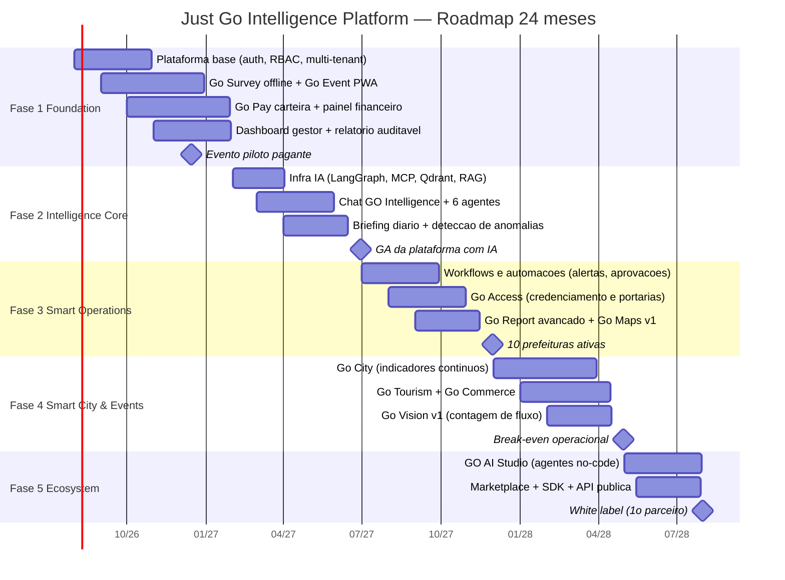

# Roadmap de Produto — 24 Meses (ago/2026 → jul/2028)

| Campo | Valor |
|---|---|
| Produto | Just Go Intelligence Platform |
| Empresa | Just Go Smart Access |
| Horizonte | Agosto/2026 a Julho/2028 (24 meses) |
| Versão | 1.0 — Julho/2026 |
| Dono | Daniel Steinbruch |

---

## 1. Régua de partida — Fase 0 (concluída)

O roadmap não parte do zero. Já existe, em produção:

| Ativo | Status | Evidência |
|---|---|---|
| Landing-demo + app do visitante (vanilla JS) | Publicado | `https://danielsmartaccess.github.io/justgo-demo/` |
| Caso real de pesquisa de evento | Entregue | Festival Canaã Cidade Junina — 1.647 entrevistas digitais |
| Impacto econômico medido | Validado | R$ 8,2 milhões |
| Satisfação medida | Validado | 94% |
| Parceria de pesquisa | Ativa | Foccus Pesquisas |
| Identidade visual | Definida | "Just" navy + "Go" azul #00AEEF; app dark preto/azul/dourado |

**Lição da Fase 0:** o mercado paga por prestação de contas auditável e impacto econômico medido — não por "mais um app de evento". Todo o roadmap prioriza esse valor central.

---

## 2. Visão geral das 5 fases

| Fase | Nome | Período | Duração | Tema |
|---|---|---|---|---|
| 1 | Foundation | ago/2026 – jan/2027 | 6 meses | MVP SaaS multi-tenant |
| 2 | Intelligence Core | fev/2027 – jun/2027 | 5 meses | IA núcleo (GO Intelligence) |
| 3 | Smart Operations | jul/2027 – nov/2027 | 5 meses | Automação e workflows |
| 4 | Smart City & Events | dez/2027 – abr/2028 | 5 meses | Verticais Go City/Tourism/Commerce |
| 5 | Ecosystem | mai/2028 – jul/2028+ | 3 meses (início) | Marketplace, SDK, white label |

---

## 3. Fase 1 — Foundation (ago/2026 – jan/2027)

**Objetivo:** transformar o MVP validado em produto SaaS multi-tenant vendável, com o ciclo completo de um evento (pesquisa → app → cashless → relatório auditável) rodando sem engenharia no circuito.

### Entregáveis
- Plataforma base: auth, RBAC (7 papéis), multi-tenant com RLS, trilha de auditoria.
- **Go Survey**: builder de questionários, cotas, coleta offline-first (PWA), QA automático de entrevistas.
- **Go Event**: app do visitante PWA (programação, mapa, avisos push, pesquisa embutida) — reescrita do demo vanilla JS em Next.js.
- **Go Pay v1**: carteira com recarga Pix, pagamento por QR, painel financeiro, conciliação, controle total para gestão municipal.
- Dashboard do gestor com KPIs em tempo real + **Relatório de Prestação de Contas** (PDF com hash e versão imutável).
- Infra: Next.js/TS/Tailwind, FastAPI, PostgreSQL/Redis, Docker/K8s gerenciado, CI/CD, observabilidade.

### Critérios de saída (exit criteria)
1. Evento piloto pagante executado ponta a ponta com 0 entrevistas perdidas e conciliação Go Pay sem divergência.
2. Relatório auditável aceito pelo controle interno do cliente piloto.
3. 2 tenants ativos (1 prefeitura + 1 organizador privado).
4. Onboarding de tenant em < 1 dia sem intervenção de engenharia.
5. Pentest sem vulnerabilidades críticas abertas.

### Equipe
| Papel | Qtde |
|---|---|
| Fundador (produto + comercial) | 1 |
| Eng. full-stack sênior (Next.js/FastAPI) | 2 |
| Eng. mobile/PWA (offline-first) | 1 |
| Designer produto (Go DS) | 1 (parcial) |
| QA | 1 (parcial) |

### Riscos da fase
- Go Pay: definição regulatória (emissor vs. orquestrador sobre PSP) pode atrasar 4–6 semanas → decidir no mês 1.
- Sazonalidade: perder a janela de eventos de dezembro/2026 adia o piloto para junho/2027 → piloto contratado até out/2026.

**Marco comercial: PRIMEIRO CLIENTE PAGANTE — dez/2026.**

---

## 4. Fase 2 — Intelligence Core (fev/2027 – jun/2027)

**Objetivo:** colocar a IA no centro da proposta de valor: de "plataforma que mostra dados" para "plataforma que recomenda decisões".

### Entregáveis
- Infra de IA: LangGraph para orquestração, ferramentas via MCP, Qdrant para RAG por tenant, camada de abstração de LLM com fallback.
- **GO Intelligence Chat** com 6 agentes selecionáveis: Concierge, Gestor, Analista, Product Owner, Desenvolvedor, Professor.
- **Briefing diário** automatizado (7h) com detecção de anomalias e recomendações.
- Transparência: toda resposta numérica cita fonte e exibe a consulta executada.
- Medição de custo de LLM por tenant com cotas.
- Avaliação de respostas (útil/não útil) alimentando ciclo de qualidade.

### Critérios de saída
1. ≥ 70% das avaliações do briefing como "útil" nos tenants ativos.
2. ≥ 60% dos gestores ativos consumindo o briefing 3x+/semana.
3. Zero incidentes de vazamento cross-tenant no RAG (validado por teste adversarial).
4. Custo de IA por tenant dentro do modelo de margem definido.
5. 4 tenants ativos, 2 renovações.

### Equipe (delta sobre Fase 1)
+1 Eng. de IA (LangGraph/RAG), +1 Analista de dados (parceria Foccus para validar metodologia dos agentes).

### Riscos
- Alucinação em número oficial → validação numérica obrigatória pré-publicação; agente Analista somente leitura.
- Custo de inferência corroer margem → cotas por tenant desde o dia 1, cache agressivo de respostas.

---

## 5. Fase 3 — Smart Operations (jul/2027 – nov/2027)

**Objetivo:** automatizar a operação do evento e da gestão: menos gente olhando painel, mais fluxo disparando ação.

### Entregáveis
- Motor de **workflows**: gatilhos (KPI cruza limite, anomalia detectada) → ações (alerta WhatsApp/e-mail, tarefa, aprovação em cadeia).
- **Go Access v1**: credenciamento, listas, QR de acesso, integração com catracas parceiras, NFC no Go Pay.
- **Go Report** avançado: relatórios agendados, comparativos entre edições, templates por público (câmara, imprensa, órgãos de controle).
- **Go Maps v1**: mapa interativo do evento com camadas (PDVs, fluxo de vendas por região).
- Playbooks operacionais prontos (chuva, superlotação, incidente) acionáveis pelo agente Gestor.

### Critérios de saída
1. 50% dos alertas críticos resolvidos via workflow sem abrir dashboard.
2. Go Access operando evento de 20 mil+ pessoas/dia sem fila > 10 min.
3. NPS de gestores ≥ 50.
4. **10 prefeituras ativas** e 15+ organizadores privados.

### Equipe (delta)
+1 Eng. back-end (workflows), +1 Customer Success dedicado a prefeituras, +1 comercial (setor público).

### Riscos
- Integração com hardware de terceiros (catracas) → homologar 2 fornecedores, contrato de SLA.
- Crescimento de tenants pressionar suporte → CS + Concierge (IA) absorvendo dúvidas nível 1.

**Marco comercial: 10 PREFEITURAS ATIVAS — nov/2027.**

---

## 6. Fase 4 — Smart City & Events (dez/2027 – abr/2028)

**Objetivo:** sair do evento pontual para o contrato contínuo: a prefeitura usa a plataforma o ano todo, não só na festa junina.

### Entregáveis
- **Go City**: painel contínuo de indicadores municipais (satisfação com serviços, percepção de segurança, comércio local), com tracking trimestral em parceria com a Foccus.
- **Go Tourism**: perfil do turista, origem/destino, gasto médio, impacto econômico contínuo do turismo.
- **Go Commerce**: rede de credenciados Go Pay fora do evento (economia local, cashback municipal, programas de incentivo).
- **Go Vision v1**: contagem de fluxo por câmera (visão computacional), estimativa de público auditável — complementando a pesquisa amostral.
- i18n: espanhol (es-LA) para prospecção em cidades do Mercosul.

### Critérios de saída
1. 3 contratos anuais contínuos (não atrelados a evento único).
2. Go Vision com margem de erro de contagem validada contra método amostral da Foccus (< 10% de divergência).
3. Receita recorrente ≥ 60% da receita total.
4. **Break-even operacional.**

### Equipe (delta)
+1 Eng. de visão computacional, +1 cientista de dados, +1 CS.

### Riscos
- Go Vision e LGPD (imagens em espaço público) → RIPD específico, processamento na borda sem armazenar rostos, contagem anônima por design.
- Verticais diluírem foco → cada vertical só inicia com 2 clientes-âncora contratados.

**Marco comercial: BREAK-EVEN OPERACIONAL — abr/2028.**

---

## 7. Fase 5 — Ecosystem (mai/2028 em diante; primeiros 3 meses no horizonte)

**Objetivo:** transformar produto em plataforma: terceiros constroem sobre a Just Go.

### Entregáveis (primeiros 3 meses)
- **GO AI Studio**: criação de agentes no-code pelo próprio cliente (prompt, ferramentas MCP permitidas, base de conhecimento própria) com guard-rails da plataforma.
- **API pública** documentada + **SDK** (TypeScript e Python) com sandbox.
- **Marketplace v1**: templates de questionários, dashboards, workflows e agentes publicáveis por parceiros (revenue share).
- **White label**: primeira instância com marca de parceiro (institutos de pesquisa regionais como canal — modelo validado com a Foccus).

### Critérios de saída
1. 1º parceiro white label em produção.
2. 10 itens de terceiros no Marketplace.
3. 20% dos tenants com ≥ 1 agente criado no GO AI Studio.
4. 5 integrações externas ativas via API pública.

### Equipe (delta)
+1 Developer Relations/documentação, +1 Eng. plataforma (API/SDK).

### Riscos
- Abrir API cedo demais congela contratos internos ruins → versionamento semântico e API interna estabilizada na Fase 4.
- Agentes no-code gerando respostas fora de controle → guard-rails obrigatórios, revisão de publicação, sandbox de teste.

---

## 8. Marcos comerciais consolidados

| Marco | Data alvo | Fase |
|---|---|---|
| Primeiro cliente pagante | dez/2026 | 1 |
| GA da plataforma com IA | jun/2027 | 2 |
| 10 prefeituras ativas | nov/2027 | 3 |
| 3 contratos anuais contínuos | mar/2028 | 4 |
| Break-even operacional | abr/2028 | 4 |
| 1º parceiro white label | jul/2028 | 5 |

## 9. Princípios de gestão do roadmap

1. **Valor central primeiro:** nada entra no trimestre se não reforçar prestação de contas auditável, impacto medido ou decisão em tempo real.
2. **Vertical só com âncora:** nenhum módulo novo inicia sem 2 clientes comprometidos.
3. **Sazonalidade manda:** releases críticos de operação sempre 60 dias antes das janelas de junho e dezembro.
4. **Revisão trimestral:** este roadmap é revisado a cada trimestre com dados de uso, pipeline comercial e feedback da Foccus e dos tenants.
