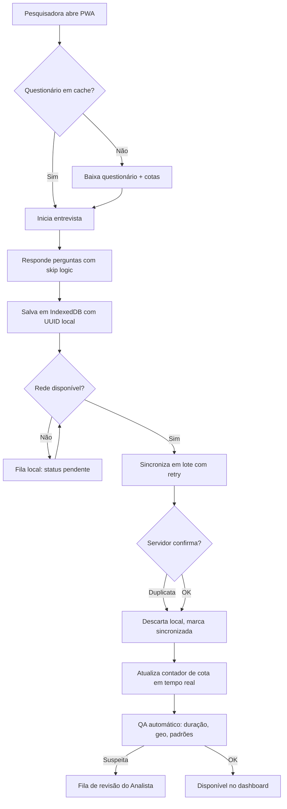
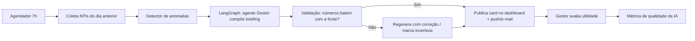
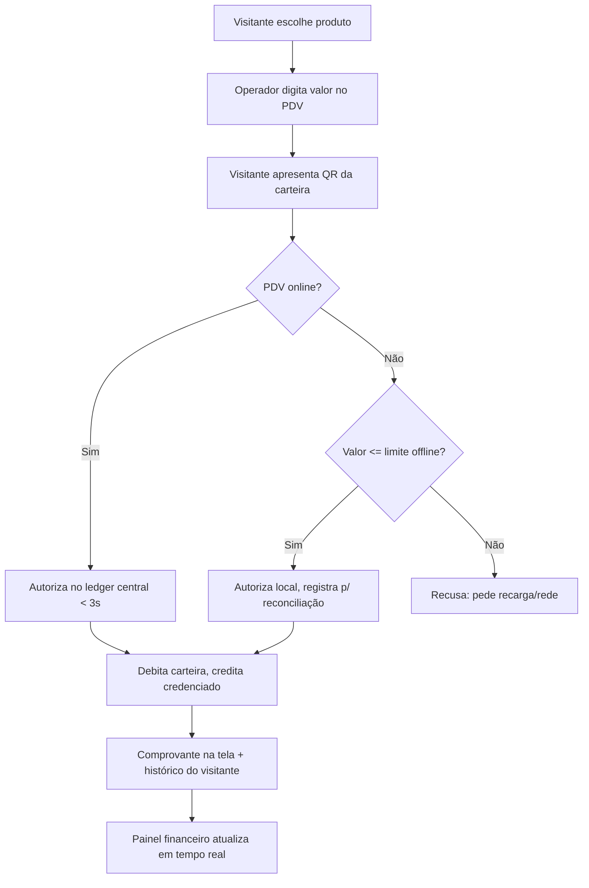

# PRD — Just Go Intelligence Platform (Fases 1 e 2: Foundation + Intelligence Core)

| Campo | Valor |
|---|---|
| Produto | Just Go Intelligence Platform |
| Empresa | Just Go Smart Access |
| Documento | PRD — Fases 1 (Foundation) e 2 (Intelligence Core) |
| Versão | 1.0 |
| Data | Julho/2026 |
| Autor | Daniel Steinbruch (fundador) + time de produto |
| Status | Em revisão |
| Parceiro de pesquisa | Foccus Pesquisas |

---

## 1. Contexto e objetivos

### 1.1 De onde partimos (Fase 0 — já entregue)

A Just Go Smart Access já validou o conceito em produção com um MVP real:

- **Landing-demo + app do visitante** em vanilla JS, publicado em `https://danielsmartaccess.github.io/justgo-demo/`.
- **Caso real:** pesquisa do **Festival Canaã Cidade Junina**, com **1.647 entrevistas digitais**, impacto econômico medido de **R$ 8,2 milhões** e **94% de satisfação**, executada em parceria com a **Foccus Pesquisas**.
- Identidade visual consolidada: marca "Just" (navy) + "Go" (azul #00AEEF), app do visitante em dark premium (preto/azul/dourado).

O MVP provou três hipóteses: (1) prefeituras pagam por **prestação de contas auditável** de eventos; (2) coleta digital em campo funciona mesmo com conectividade precária; (3) o dado de impacto econômico muda a conversa política sobre investimento em eventos.

### 1.2 O que este PRD cobre

A evolução do MVP para uma **Decision Intelligence Platform** multi-tenant SaaS, em duas fases:

- **Fase 1 — Foundation:** plataforma SaaS com autenticação, RBAC, multi-tenant, dashboard do gestor, Go Survey (com coleta offline), Go Event (app do visitante) e Go Pay (carteira cashless básica).
- **Fase 2 — Intelligence Core:** IA central **GO Intelligence** com chat multi-agente (Concierge, Gestor, Analista, Product Owner, Desenvolvedor, Professor) e **briefing diário automatizado**.

### 1.3 Objetivos de negócio

| # | Objetivo | Meta (12 meses pós-lançamento) |
|---|---|---|
| O1 | Converter o caso Canaã em receita recorrente | 5 contratos municipais assinados |
| O2 | Reduzir custo de campo da Foccus por entrevista | -40% vs. processo atual |
| O3 | Tornar o relatório de prestação de contas produto, não serviço | 100% dos eventos com relatório auditável gerado na plataforma |
| O4 | Estabelecer a IA como diferencial competitivo | 60% dos gestores ativos usando o briefing diário |

### 1.4 Fora do horizonte deste PRD

Go City, Go Tourism, Go Commerce, Go Vision, Go Maps completos, GO AI Studio, Marketplace/SDK/white label — cobertos no roadmap (doc `05-roadmap-24-meses.md`), Fases 3–5.

---

## 2. Personas

### P1 — Secretário(a) Municipal de Cultura/Turismo ("Gestora Márcia")
- 45–60 anos, agenda política, baixa fluência técnica, alta pressão por resultados visíveis.
- **Dores:** prestação de contas manual e frágil perante órgãos de controle; não sabe o retorno real dos eventos que financia; decide no escuro durante o evento.
- **Ganhos esperados:** relatório auditável com um clique; número de impacto econômico defensável; briefing diário em linguagem simples.

### P2 — Organizador(a) de Eventos/Festivais ("Produtor Rafael")
- 30–45 anos, opera 3–10 eventos/ano, vive de margem apertada e patrocínio.
- **Dores:** não tem dados para vender patrocínio; caixa do evento (cashless) fragmentado em fornecedores caros; operação reativa.
- **Ganhos:** dashboard em tempo real; Go Pay com taxas transparentes; dados de público para mídia kit.

### P3 — Pesquisador(a) de Campo ("Entrevistadora Joana", equipe Foccus)
- 20–35 anos, usa o próprio celular, trabalha em locais com 3G intermitente ou sem sinal.
- **Dores:** apps que perdem entrevistas sem sinal; formulários lentos; retrabalho de digitação.
- **Ganhos:** coleta offline confiável com sincronização automática; questionário rápido de navegar; contador de cota visível.

### P4 — Analista de Dados/Pesquisa ("Analista Pedro", Foccus ou prefeitura)
- 25–40 anos, domina Excel/Power BI, cético com "IA mágica".
- **Dores:** limpeza manual de dados; cruzamentos repetitivos; prazo curto para relatório.
- **Ganhos:** dados já estruturados e exportáveis; agente Analista que executa cruzamentos sob demanda com metodologia explícita; rastreabilidade de cada número.

### P5 — Visitante do Evento ("Visitante Camila")
- 18–55 anos, chega ao evento pelo Instagram, quer programação, mapa e pagar sem fila.
- **Dores:** filas de recarga; não encontra atrações; não é ouvida.
- **Ganhos:** app PWA leve (sem instalação obrigatória), carteira Go Pay, programação, pesquisa de satisfação rápida com incentivo.

### P6 — Auditor(a)/Controle Interno ("Auditor Fernando")
- 35–55 anos, prefeitura ou órgãos de controle, precisa de trilha documental.
- **Dores:** notas fiscais soltas, planilhas sem origem, números não reproduzíveis.
- **Ganhos:** trilha de auditoria imutável (quem, quando, o quê), metodologia da pesquisa anexada, exportação certificada (hash + carimbo de tempo).

---

## 3. Jobs-to-be-Done

| # | Quando... (situação) | Quero... (motivação) | Para... (resultado) |
|---|---|---|---|
| JTBD-1 | Sou questionada sobre o gasto com um festival | provar o retorno econômico com dados auditáveis | defender o orçamento perante câmara e órgãos de controle |
| JTBD-2 | Estou no meio do evento e algo muda (chuva, fila, incidente) | ver a situação em tempo real e receber recomendação | decidir em minutos, não no dia seguinte |
| JTBD-3 | Estou em campo sem sinal | registrar entrevistas sem perder nenhuma | cumprir minha cota e ir embora no horário |
| JTBD-4 | Preciso montar o relatório final do evento | gerar análises e o documento em horas | entregar antes do ciclo de notícias esfriar |
| JTBD-5 | Sou visitante com pressa | pagar e me localizar sem fila e sem baixar app pesado | aproveitar o evento |
| JTBD-6 | Preciso vender patrocínio do próximo evento | ter perfil de público e resultados do evento anterior | precificar cotas com evidência |

---

## 4. Escopo

### 4.1 Dentro do escopo (Fases 1+2)

| Área | Incluído |
|---|---|
| Plataforma | Multi-tenant SaaS, auth (e-mail/senha + OAuth Google), RBAC, gestão de organizações e eventos |
| Go Survey | Builder de questionários, coleta offline-first (PWA), cotas, sincronização, exportação CSV/XLSX |
| Go Event | App do visitante PWA (programação, mapa estático, avisos, pesquisa embutida) |
| Go Pay | Carteira digital do visitante (recarga Pix, QR de pagamento), painel financeiro do evento, conciliação, extrato auditável |
| Dashboard | Painel do gestor com KPIs em tempo real, painel do organizador, relatório de prestação de contas exportável (PDF) |
| GO Intelligence | Chat com seleção de agentes (Concierge, Gestor, Analista, Product Owner, Desenvolvedor, Professor), briefing diário, RAG sobre dados do tenant |
| Infra | FastAPI, PostgreSQL, Redis, Qdrant, LangGraph, MCP, Docker/K8s; front Next.js/TS/Tailwind |

### 4.2 Fora do escopo (Fases 1+2)

- Go City, Go Tourism, Go Commerce, Go Vision (câmeras/CV), Go Maps avançado (heatmap de fluxo), Go Access (controle de acesso físico/catracas).
- GO AI Studio (criação de agentes no-code), Marketplace, SDK público, white label.
- Emissão de cartões físicos NFC no Go Pay (fase 1 usa QR; NFC entra na Fase 3).
- App nativo iOS/Android (PWA primeiro; nativo reavaliado na Fase 3).
- i18n além de pt-BR (estrutura preparada, tradução não).

---

## 5. Requisitos Funcionais

### 5.1 Autenticação, RBAC e Multi-tenant

| ID | Requisito | Prioridade |
|---|---|---|
| RF-001 | O sistema deve permitir cadastro e login por e-mail/senha com verificação de e-mail. | P0 |
| RF-002 | O sistema deve suportar login social via Google OAuth 2.0. | P1 |
| RF-003 | O sistema deve isolar dados por tenant (organização) em todas as consultas, com `tenant_id` obrigatório na camada de acesso a dados (row-level security no PostgreSQL). | P0 |
| RF-004 | O sistema deve oferecer os papéis: Administrador da Plataforma, Admin do Tenant, Gestor, Organizador, Analista, Pesquisador de Campo, Auditor (somente leitura). | P0 |
| RF-005 | Toda ação de escrita deve gerar registro de auditoria imutável (usuário, ação, entidade, timestamp, IP). | P0 |
| RF-006 | O Admin do Tenant deve poder convidar usuários por e-mail com papel pré-atribuído e expiração de convite em 7 dias. | P0 |
| RF-007 | O sistema deve suportar MFA por TOTP para papéis Gestor, Admin e Auditor. | P1 |
| RF-008 | Sessões devem expirar em 24h (web) e 30 dias (PWA de campo, para operação offline prolongada). | P0 |

### 5.2 Dashboard do Gestor

| ID | Requisito | Prioridade |
|---|---|---|
| RF-020 | O dashboard deve exibir KPIs do evento ativo: público estimado, entrevistas coletadas, satisfação (CSAT/NPS parcial), volume transacionado no Go Pay, ticket médio — com atualização máxima de 60 segundos. | P0 |
| RF-021 | O dashboard deve exibir o card de **briefing diário da IA** (ver RF-090) em posição de destaque. | P0 |
| RF-022 | O gestor deve poder alternar entre visão "evento ao vivo" e visão "consolidado histórico" (comparativo entre edições/eventos). | P1 |
| RF-023 | O sistema deve gerar o **Relatório de Prestação de Contas** em PDF com: metodologia da pesquisa, amostra, resultados, impacto econômico calculado, extrato financeiro do Go Pay, hash SHA-256 do conteúdo e carimbo de data/hora. | P0 |
| RF-024 | O relatório deve manter versão imutável arquivada; regenerações criam nova versão sem apagar anteriores. | P0 |
| RF-025 | O dashboard deve permitir compartilhar visão somente leitura via link expirável (para prefeito, imprensa, órgãos de controle). | P1 |
| RF-026 | Alertas configuráveis devem notificar o gestor (in-app + e-mail) quando um KPI cruzar limite definido (ex.: satisfação < 80%). | P1 |

### 5.3 Go Survey (coleta offline)

| ID | Requisito | Prioridade |
|---|---|---|
| RF-040 | O Analista deve poder criar questionários com tipos: escolha única, múltipla, escala (0–10, 1–5), NPS, texto curto/longo, numérico, data, seção condicional (skip logic). | P0 |
| RF-041 | O builder deve suportar lógica de pulo com pré-visualização do fluxo. | P0 |
| RF-042 | O sistema deve permitir definição de **cotas** por variável (sexo, faixa etária, local) com contador em tempo real visível ao pesquisador. | P0 |
| RF-043 | O app de coleta (PWA) deve funcionar **100% offline** após primeiro carregamento: questionário, respostas e mídia ficam em armazenamento local (IndexedDB). | P0 |
| RF-044 | A sincronização deve ser automática ao detectar rede, com fila resiliente, retry exponencial e deduplicação por UUID gerado no dispositivo. | P0 |
| RF-045 | Nenhuma entrevista pode ser perdida: o app deve exibir contadores "coletadas / sincronizadas / pendentes" e impedir logout com pendências não sincronizadas sem confirmação dupla. | P0 |
| RF-046 | Cada entrevista deve registrar metadados: geolocalização (com consentimento), duração, dispositivo, pesquisador — para controle de qualidade da Foccus. | P0 |
| RF-047 | O sistema deve sinalizar entrevistas suspeitas (duração < limiar, sequência de respostas idênticas, geolocalização fora do polígono do evento) para revisão do Analista. | P1 |
| RF-048 | Resultados devem ser exportáveis em CSV, XLSX e via API autenticada. | P0 |
| RF-049 | O Analista deve poder publicar uma versão pública do questionário (link/QR) para autopreenchimento pelo visitante, com identificação de origem (campo vs. autoaplicada). | P1 |

### 5.4 Go Event (app do visitante)

| ID | Requisito | Prioridade |
|---|---|---|
| RF-060 | O app do visitante deve ser PWA instalável, com carregamento inicial < 3 s em 4G e funcionamento parcial offline (programação e mapa em cache). | P0 |
| RF-061 | Deve exibir programação por dia/palco com favoritos e lembretes (notificação push web, opt-in). | P0 |
| RF-062 | Deve exibir mapa do evento (imagem estática georreferenciada na Fase 1) com pontos de interesse: palcos, banheiros, recarga, saúde, saídas. | P0 |
| RF-063 | Organizador deve poder publicar avisos em tempo real (mudança de horário, emergência) com push. | P0 |
| RF-064 | O app deve embutir pesquisas do Go Survey com incentivo configurável (ex.: cupom de crédito Go Pay). | P1 |
| RF-065 | Cadastro do visitante deve ser opcional para navegação e obrigatório apenas para Go Pay, pedindo o mínimo (nome, CPF, telefone) com consentimento LGPD explícito. | P0 |

### 5.5 Go Pay (carteira cashless)

| ID | Requisito | Prioridade |
|---|---|---|
| RF-080 | O visitante deve poder criar carteira e recarregar via Pix com crédito disponível em até 10 segundos após confirmação do PSP. | P0 |
| RF-081 | Pagamento em ponto de venda por QR code dinâmico (visitante apresenta, operador escaneia — ou o inverso), com confirmação em < 3 s online. | P0 |
| RF-082 | O modo de contingência offline do PDV deve aceitar transações abaixo de limite configurável, com reconciliação posterior e trava de risco por carteira. | P1 |
| RF-083 | O painel financeiro do evento deve exibir em tempo real: volume bruto, por ponto de venda, por categoria, ticket médio, recargas vs. consumo, saldo não consumido. | P0 |
| RF-084 | A gestão municipal (quando cliente) deve ter **controle total e visão integral** do fluxo financeiro: taxas, repasses, extrato por credenciado, exportação contábil — sem intermediário opaco. | P0 |
| RF-085 | Reembolso de saldo não consumido deve ser solicitável pelo visitante via Pix em até X dias após o evento (X configurável por contrato), com trilha de auditoria. | P0 |
| RF-086 | Toda transação deve ser imutável no ledger (apenas estornos compensatórios, nunca edição/exclusão). | P0 |
| RF-087 | Conciliação diária automática entre ledger interno e extrato do PSP, com relatório de divergências. | P0 |

### 5.6 GO Intelligence (chat + briefing diário) — Fase 2

| ID | Requisito | Prioridade |
|---|---|---|
| RF-090 | O sistema deve gerar **briefing diário** por evento ativo (7h, horário configurável): resumo do dia anterior, KPIs, anomalias, recomendações — em linguagem executiva pt-BR, máximo 300 palavras. | P0 |
| RF-091 | O chat GO Intelligence deve permitir seleção explícita de agente: **Concierge** (onboarding/dúvidas de uso), **Gestor** (visão executiva/decisão), **Analista** (cruzamentos e estatística sobre dados do tenant), **Product Owner** (backlog/priorização do próprio cliente), **Desenvolvedor** (API/integrações), **Professor** (capacitação e explicação de conceitos). | P0 |
| RF-092 | Toda resposta com números deve citar a fonte (dataset, filtro, período) e permitir "ver consulta" (transparência da query executada). | P0 |
| RF-093 | O agente Analista deve executar consultas apenas em modo leitura, sobre réplica, com limites de tempo e volume. | P0 |
| RF-094 | O RAG deve indexar somente documentos e dados do tenant (isolamento por coleção no Qdrant), nunca cruzando tenants. | P0 |
| RF-095 | A orquestração dos agentes deve usar LangGraph, com ferramentas expostas via MCP, e fallback gracioso quando o provedor de LLM estiver indisponível ("modo somente dados"). | P0 |
| RF-096 | O usuário deve poder avaliar cada resposta (útil/não útil + comentário), alimentando métrica de qualidade da IA. | P1 |
| RF-097 | Custos de LLM devem ser medidos por tenant, com cota configurável e alerta a 80% do limite. | P0 |

---

## 6. Requisitos Não-Funcionais

| ID | Categoria | Requisito |
|---|---|---|
| RNF-001 | Desempenho | P95 de resposta de API < 500 ms para leituras e < 1 s para escritas; dashboard carrega em < 2,5 s em 4G. |
| RNF-002 | Desempenho | Sincronização de 500 entrevistas offline em < 90 s em conexão 4G. |
| RNF-003 | Disponibilidade | 99,5% mensal na Fase 1; 99,9% durante janelas de evento declaradas (war-room). Go Pay: transação nunca bloqueada por indisponibilidade do módulo de IA. |
| RNF-004 | LGPD | Base legal documentada por finalidade; consentimento granular e revogável; anonimização de microdados de pesquisa em exportações públicas; DPO nomeado; relatório de impacto (RIPD) para Go Pay e geolocalização; direito de eliminação atendido em até 15 dias. |
| RNF-005 | Segurança | Dados criptografados em repouso (AES-256) e trânsito (TLS 1.3); segredos em vault; ledger do Go Pay com hash encadeado; pentest antes do primeiro evento pago. |
| RNF-006 | Acessibilidade | Conformidade WCAG 2.1 AA em todas as interfaces web e PWA: contraste, navegação por teclado, leitores de tela, foco visível. |
| RNF-007 | Offline | Go Survey opera 72 h contínuas offline sem perda; Go Event mantém programação e mapa em cache; estratégia local-first com resolução de conflitos por last-write-wins + trilha. |
| RNF-008 | i18n | pt-BR como idioma primário e único na Fase 1; todo texto externalizado em arquivos de mensagem desde o início (preparação para es-LA e en na Fase 4). |
| RNF-009 | Escalabilidade | Suportar 50 mil visitantes simultâneos no app do evento e 200 transações Go Pay/s em pico, com autoscaling no K8s. |
| RNF-010 | Observabilidade | Logs estruturados, tracing distribuído (OpenTelemetry), alertas de SLO; painel de saúde por evento ativo. |
| RNF-011 | Auditabilidade | Trilha de auditoria retida por 5 anos; relatórios com hash verificável publicamente. |
| RNF-012 | IA responsável | Respostas da IA nunca apresentadas como decisão final; disclaimers em recomendações; log de prompts/respostas por 90 dias para revisão de qualidade. |

---

## 7. Fluxos críticos

### 7.1 Coleta offline e sincronização (Go Survey)

### 7.2 Briefing diário do GO Intelligence

### 7.3 Pagamento Go Pay no ponto de venda

---

## 8. Critérios de aceite de alto nível

| # | Critério | Como verificar |
|---|---|---|
| CA-1 | Um evento completo (pesquisa + app + cashless + relatório) roda ponta a ponta sem intervenção da engenharia. | Ensaio geral com evento piloto |
| CA-2 | 0 entrevistas perdidas em teste de campo com 8 h offline e 20 dispositivos. | Teste de campo controlado |
| CA-3 | Relatório de prestação de contas aceito sem ressalvas por controle interno de prefeitura piloto. | Validação com cliente |
| CA-4 | Conciliação Go Pay fecha com divergência zero em evento piloto. | Auditoria de ledger vs. PSP |
| CA-5 | Briefing diário avaliado como "útil" em ≥ 70% das avaliações no piloto. | RF-096 |
| CA-6 | Auditoria de acessibilidade AA sem bloqueios críticos. | Avaliação com axe + teste manual NVDA |
| CA-7 | Isolamento multi-tenant validado por teste de penetração (nenhum vazamento cross-tenant). | Pentest |

---

## 9. Métricas de sucesso

| Métrica | Definição | Meta 6 meses | Meta 12 meses |
|---|---|---|---|
| Ativação | Tenant que publica 1º evento com ≥ 1 módulo ativo em 30 dias | 60% | 75% |
| Retenção de tenant | Tenants que realizam 2º evento na plataforma | 50% | 70% |
| Adoção do briefing | Gestores ativos que abrem o briefing ≥ 3x/semana | 40% | 60% |
| NPS (gestores/organizadores) | Pesquisa trimestral in-app | ≥ 40 | ≥ 55 |
| Qualidade da coleta | % entrevistas sincronizadas sem perda | 100% | 100% |
| Utilidade da IA | % respostas avaliadas como úteis | 65% | 80% |
| Tempo até relatório | Horas entre fim do evento e relatório final | < 48 h | < 24 h |
| Receita | MRR de contratos SaaS + eventos | 1º cliente pagante | 5 prefeituras |

---

## 10. Dependências e riscos

### 10.1 Dependências

| Dependência | Tipo | Mitigação |
|---|---|---|
| PSP para Pix/adquirência do Go Pay | Externa crítica | Selecionar 2 PSPs homologados; abstração de gateway |
| Provedor de LLM (API) | Externa | Camada de abstração; fallback entre provedores; modo degradado sem IA |
| Parceria Foccus para metodologia e campo | Estratégica | Contrato de parceria formalizado; metodologia co-assinada |
| Calendário de eventos municipais (sazonal: junho/dezembro) | Mercado | Pipeline comercial alinhado ao roadmap; piloto marcado com antecedência |
| Infra K8s gerenciada | Externa | Iniciar com managed (GKE) e IaC desde o dia 1 |

### 10.2 Riscos

| Risco | Prob. | Impacto | Mitigação |
|---|---|---|---|
| Ciclo de venda pública lento (licitação) | Alta | Alto | Entrada via organizadores privados + dispensa por valor; preparar documentação para adesão/credenciamento |
| Falha do Go Pay durante evento ao vivo | Média | Crítico | Modo offline de contingência (RF-082), war-room, testes de carga, PSP redundante |
| Alucinação da IA em número oficial | Média | Alto | RF-092 (citação de fonte obrigatória), validação numérica pré-publicação, RNF-012 |
| Escopo LGPD do Go Pay (dados financeiros + CPF) | Média | Alto | RIPD antecipado, minimização de dados, consultoria jurídica antes do piloto |
| Equipe pequena vs. amplitude de módulos | Alta | Médio | Cortes de escopo explícitos (seção 4.2), P0/P1 rigoroso |
| Dependência de um caso único (Canaã) para vendas | Média | Médio | 2º e 3º estudos de caso na Fase 1 com desconto de piloto |

---

## 11. Questões em aberto

| # | Questão | Dono | Prazo |
|---|---|---|---|
| Q1 | Go Pay será emissor próprio de conta de pagamento ou orquestrador sobre PSP? (implicações regulatórias BACEN) | Fundador + jurídico | Antes do design técnico do Go Pay |
| Q2 | Modelo comercial: SaaS por assinatura, taxa por transação Go Pay, ou híbrido por evento? | Fundador | Fase 1, mês 2 |
| Q3 | A Foccus terá tenant próprio revendendo a plataforma (canal) ou opera dentro do tenant do cliente? | Fundador + Foccus | Fase 1, mês 1 |
| Q4 | Limite de contingência offline do Go Pay: valor fixo ou dinâmico por perfil de risco? | Produto + risco | Fase 1, mês 4 |
| Q5 | Briefing diário via WhatsApp (canal preferido de gestores) exige provedor oficial — entra na Fase 2 ou 3? | Produto | Fase 2, mês 1 |
| Q6 | Qual provedor de LLM primário considerando custo por tenant (RF-097) e residência de dados? | Engenharia | Fase 2, mês 1 |

---

*Documento vivo. Alterações via pull request com revisão do time de produto.*
