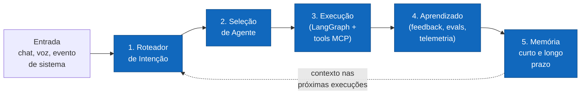
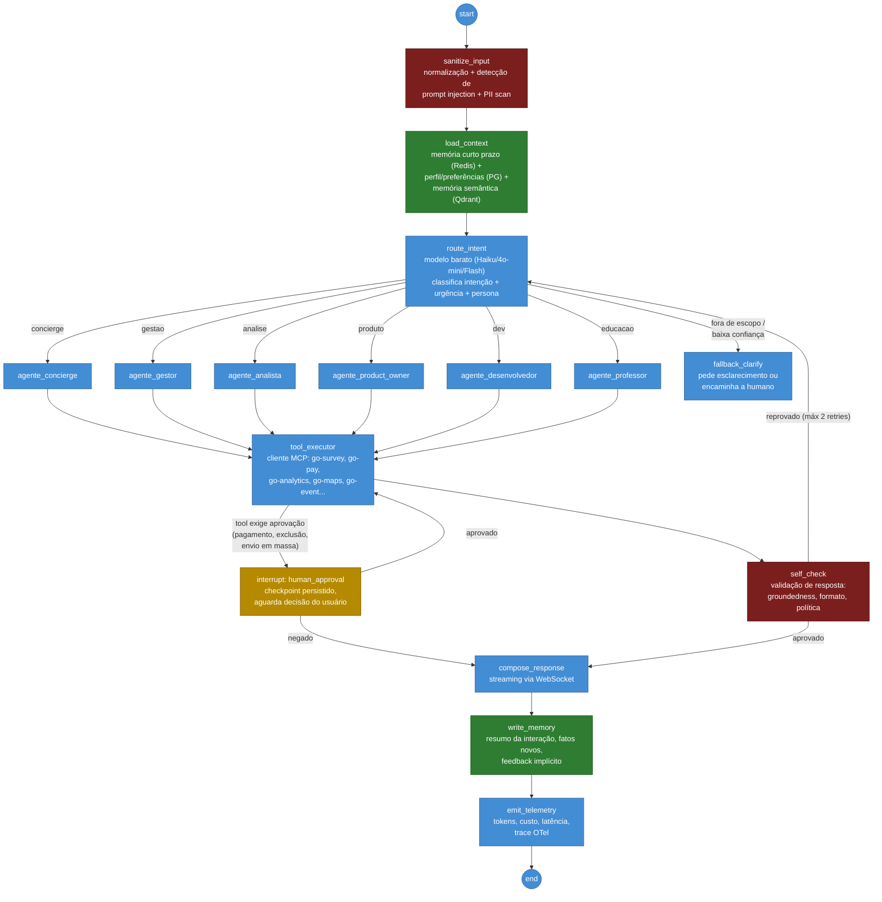
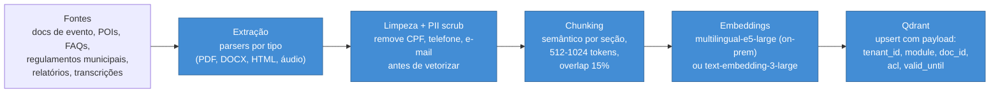
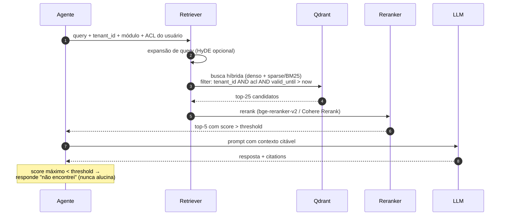
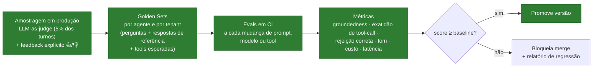

# 07 — Arquitetura de IA e Agentes

> **Just Go Intelligence Platform** — camada de inteligência da plataforma: o agente central **GO Intelligence** e a engine de agentes especializados.
> **Orquestrador:** LangGraph (ADR-003; CrewAI avaliado como alternativa — descartado para produção por menor controle de estado e de interrupções, mantido como opção de prototipagem).
> **Documentos relacionados:** [04-arquitetura-c4.md](./04-arquitetura-c4.md) · [08-modelo-de-dados.md](./08-modelo-de-dados.md)

---

## 1. Visão Geral — GO Intelligence

GO Intelligence é o agente central da plataforma: um **roteador cognitivo** que recebe qualquer solicitação (visitante, gestor, pesquisador, expositor, comerciante), classifica a intenção, seleciona o agente especializado adequado, supervisiona a execução e consolida aprendizado em memória.



**Princípios de projeto:**

1. **Um grafo, muitos agentes** — os agentes são subgrafos/nós dentro de um único grafo LangGraph supervisionado; não há agentes "soltos".
2. **Ferramentas só via MCP** — nenhum agente acessa banco ou API diretamente; toda ação passa por tools MCP com escopo de tenant e RBAC herdados da sessão do usuário.
3. **Human-in-the-loop para ações críticas** — pagamentos, exclusões, publicações e envios em massa exigem aprovação explícita (interrupt do LangGraph).
4. **Custo é requisito funcional** — triagem com modelo barato; modelo forte apenas onde a tarefa exige.

---

## 2. Grafo LangGraph — Fluxo Principal



**Detalhes de implementação:**

- **Estado do grafo** (`GoState`): `tenant_id`, `user_id`, `persona`, `messages[]`, `intent`, `selected_agent`, `tool_calls[]`, `pending_approval`, `citations[]`, `cost_accumulated`.
- **Checkpointer:** PostgreSQL (`langgraph.checkpoints`) — conversas sobrevivem a deploy e permitem retomar interrupts de aprovação horas depois.
- **Interrupts:** `interrupt_before=["human_approval"]`; a aprovação chega por endpoint REST que injeta a decisão no estado e retoma o grafo.
- **Limites:** máximo de 8 iterações de tool-calling por turno; orçamento de custo por conversa configurável por tenant (default R$ 0,50/turno).

---

## 3. Agentes Especializados

| Agente | Objetivo | Persona atendida | Tools MCP principais | Modelo recomendado | Memória | Guardrails específicos |
|---|---|---|---|---|---|---|
| **Concierge** | Assistir visitante/turista: programação, rotas, recomendações, saldo cashless | Visitante | `go-event.*`, `go-maps.*`, `go-tourism.*`, `go-pay.get_balance` | Claude Haiku / Gemini Flash (volume alto, latência baixa) | Curto prazo + preferências do visitante | Somente leitura em Go Pay; nunca revela dados de outros visitantes |
| **Gestor** | Apoiar gestor municipal: status do evento, alertas operacionais, controle financeiro | Gestor Municipal | `go-analytics.*`, `go-pay.report_*`, `go-report.*`, `go-event.ops_status` | Claude Sonnet (raciocínio sobre operação) | Longo prazo por tenant (decisões, metas) | Ações de escrita exigem RBAC de gestor; valores financeiros sempre citados com fonte |
| **Analista** | Análises estatísticas de pesquisas e KPIs; rigor metodológico (playbook Foccus) | Gestor, Pesquisador (supervisor) | `go-survey.query_results`, `go-analytics.timeseries`, `go-report.generate` | Claude Opus/Sonnet (análise complexa); code-interpreter sandbox para estatística | Longo prazo: metodologias e séries históricas | Obrigado a declarar margem de erro, n amostral e limitações; jamais extrapola sem base |
| **Product Owner** | Transformar feedback e dados de uso em backlog, user stories e roadmap dos módulos | Equipe Just Go, Expositor (feedback) | `go-analytics.usage`, `go-survey.feedback`, `marketplace.ideas` | Claude Sonnet | Longo prazo: backlog e decisões de produto | Não promete features a usuários finais; output interno |
| **Desenvolvedor** | Suporte técnico a integradores do Marketplace/SDK; gera exemplos de código e diagnostica erros de API | Integradores, equipe | `platform.api_docs`, `platform.logs_query` (mascarado), `marketplace.sdk` | Claude Sonnet | Curto prazo por sessão | Logs sempre com PII mascarada; nunca expõe segredos/keys |
| **Professor** | Educação corporativa: treinar entrevistadores, onboarding de gestores e comerciantes | Pesquisador, Comerciante, Gestor | `go-survey.training_mode`, `platform.docs`, `go-pay.simulator` | Gemini Flash / Haiku (didático, volume) | Longo prazo: progresso do aluno | Ambiente de treino isolado (sandbox); dados sintéticos apenas |

**Convenções comuns a todos os agentes:**

- System prompt versionado em repositório (`prompts/<agente>/vN.md`) com testes de regressão (evals) antes de promover versão.
- Toda resposta com dado factual da plataforma inclui `citations[]` (tool + registro consultado).
- Idioma padrão PT-BR; espelha o idioma do usuário quando diferente.

---

## 4. RAG — Retrieval-Augmented Generation

### 4.1 Pipeline de Ingestão



### 4.2 Pipeline de Consulta



**Regras de ouro do RAG:**

1. **Filtro de `tenant_id` no Qdrant é obrigatório e aplicado pelo retriever, nunca pelo prompt** — isolamento de dados não depende do LLM.
2. Conteúdo com validade (programação de evento) carrega `valid_until` — o retriever nunca serve programação vencida.
3. Groundedness verificado no nó `self_check`: afirmações sem chunk de suporte são removidas ou marcadas como inferência.

---

## 5. Memória

| Camada | Armazenamento | Conteúdo | TTL / Ciclo de vida |
|---|---|---|---|
| **Curto prazo (working)** | Redis | Janela da conversa atual, estado do grafo em execução | TTL 24h após última mensagem |
| **Episódica** | PostgreSQL (`ai_conversa`, `ai_mensagem`) | Histórico completo de conversas (auditável) | Retenção conforme política LGPD do tenant |
| **Semântica (longo prazo)** | Qdrant (coleção `memoria_agente`) | Fatos destilados: preferências do usuário, decisões do gestor, metas, aprendizados | Consolidação assíncrona pós-conversa; revisão/expurgo trimestral |
| **Procedural** | Repositório de prompts + config | Instruções, few-shots, políticas por tenant | Versionada via Git |

**Consolidação:** worker assíncrono roda após o fim de cada conversa: um modelo barato extrai "fatos memoráveis" (com classificação de sensibilidade), grava na memória semântica com `source_conversation_id` — todo fato é rastreável e apagável (LGPD, direito ao esquecimento propaga para a memória vetorial).

---

## 6. MCP Servers da Plataforma

Cada módulo vertical expõe um **MCP server** (montado sobre a API Core), com tools tipadas. O cliente MCP da engine injeta automaticamente `tenant_id` e o token do usuário — **as tools executam com as permissões do usuário da sessão, nunca com permissões de sistema**.

| MCP Server | Tools (exemplos) | Escrita? | Aprovação humana? |
|---|---|---|---|
| `go-survey` | `list_surveys`, `get_survey_results(survey_id, segment)`, `get_field_progress(survey_id)`, `create_survey_draft(spec)` | draft apenas | Publicar pesquisa → sim |
| `go-pay` | `get_balance(wallet_id)`, `get_transactions(filters)`, `report_revenue(event_id, period)`, `initiate_refund(tx_id, reason)` | refund | **Sempre** (refund e qualquer movimentação) |
| `go-analytics` | `query_kpi(kpi, period, dims)`, `get_timeseries(metric, granularity)`, `compare_editions(event_id, editions)`, `export_dataset(spec)` | não | não |
| `go-maps` | `search_poi(query, near)`, `get_route(from, to, mode)`, `get_heatmap(area, metric)` | não | não |
| `go-event` | `get_schedule(event_id, day)`, `get_ops_status(event_id)`, `update_schedule_item(id, patch)` | sim | Mudança publicada → sim |
| `go-report` | `list_templates`, `generate_report(template_id, params)`, `get_report_status(job_id)` | gera artefato | Envio a terceiros → sim |
| `go-vision` | `get_plate_reads(gate_id, period)`, `get_crowd_count(area_id)` | não | não (dados agregados; leitura de placas restrita por RBAC) |
| `platform` | `api_docs(topic)`, `docs(topic)`, `logs_query(filters)` | não | não |

**Exemplo de definição de tool (schema resumido):**

```json
{
  "name": "go_survey_get_survey_results",
  "description": "Retorna resultados agregados de uma pesquisa, com margem de erro e n amostral. Nunca retorna respostas individuais identificadas.",
  "inputSchema": {
    "type": "object",
    "properties": {
      "survey_id": { "type": "string", "format": "uuid" },
      "segment": { "type": "string", "description": "Filtro de segmento, ex.: 'faixa_etaria=25-34'" }
    },
    "required": ["survey_id"]
  },
  "annotations": { "readOnlyHint": true, "requiresApproval": false }
}
```

---

## 7. GO AI Studio — Criação de Agentes No-Code

Usuários avançados (gestores, parceiros do Marketplace) compõem agentes customizados sem código. O Studio gera um **Agent Spec JSON** validado, que a engine compila para um subgrafo LangGraph registrado no tenant.

```json
{
  "agent_spec_version": "1.0",
  "id": "agt_7f3a",
  "tenant_id": "tn_prefeitura_x",
  "name": "Assistente da Feira do Livro",
  "base_persona": "concierge",
  "instructions": "Você atende visitantes da Feira do Livro 2026...",
  "language": "pt-BR",
  "model_policy": { "tier": "economy", "max_cost_per_turn_brl": 0.10 },
  "tools": [
    { "server": "go-event", "tool": "get_schedule", "scope": "event:feira-livro-2026" },
    { "server": "go-maps", "tool": "search_poi" }
  ],
  "knowledge": { "collections": ["kb_feira_livro_2026"] },
  "memory": { "short_term": true, "long_term": false },
  "guardrails": {
    "blocked_topics": ["politica_partidaria"],
    "pii_output": "deny",
    "requires_approval": [],
    "max_tool_iterations": 4
  },
  "channels": ["pwa_chat", "web_widget"],
  "evaluation": { "golden_set": "gs_feira_livro", "min_score_to_publish": 0.85 }
}
```

**Restrições de segurança do Studio (não negociáveis):**

- Usuário só anexa tools às quais **ele próprio** tem permissão RBAC — o agente nunca escala privilégios.
- `requires_approval` de tools críticas (Go Pay, exclusões) não pode ser desativado pelo criador do agente.
- Publicação exige passar no golden set mínimo (ver §8) — agente reprovado fica em modo rascunho.

---

## 8. Avaliação de Qualidade (Evals)



- **Golden sets:** mínimo 50 casos por agente core (Concierge e Analista começam com 150 — maior volume e maior risco metodológico, respectivamente); casos adversariais incluídos (injection, pedidos fora de escopo, PII).
- **Juiz:** LLM-as-judge com rubrica fixa + amostra mensal revisada por humano para calibrar o juiz.
- **Métricas-alvo iniciais:** groundedness ≥ 0,9; tool-call accuracy ≥ 0,95; taxa de rejeição correta de injection ≥ 0,99.

---

## 9. Custos e Roteamento de Modelos

| Camada | Tarefa | Modelo (nuvem) | Modelo (on-premise/Ollama) | Custo relativo |
|---|---|---|---|---|
| Triagem | Classificação de intenção, extração simples | Claude Haiku / GPT-4o-mini / Gemini Flash | Llama 3.1 8B / Qwen 2.5 7B | $ |
| Conversação de volume | Concierge, Professor | Claude Haiku / Gemini Flash | Llama 3.1 70B (quantizado) | $$ |
| Raciocínio | Gestor, PO, Desenvolvedor | Claude Sonnet | Llama 3.3 70B | $$$ |
| Análise crítica | Analista (estatística, relatórios executivos) | Claude Opus / Sonnet com extended thinking | (recomendado manter em nuvem; se on-prem, aceitar degradação declarada) | $$$$ |
| Embeddings | RAG e memória | text-embedding-3-large | multilingual-e5-large | $ |

**Políticas de roteamento:**

1. **Escalonamento por confiança:** triagem responde diretamente se a intenção é FAQ com resposta cacheada (cache semântico no Redis: hit se similaridade > 0,95) — evita LLM caro em ~30–40% dos turnos de Concierge em pico.
2. **Degradação sob pico/orçamento:** ao atingir o teto de custo do tenant, downgrade automático de tier com aviso na resposta ("modo econômico").
3. **Fallback multi-provedor:** indisponibilidade do provedor primário → provedor secundário equivalente (mapeamento de tiers, não de modelos específicos).
4. **Contabilidade:** todo turno grava `tokens_in/out`, `model`, `cost_brl` por tenant — insumo de billing e FinOps.

---

## 10. Segurança de IA

| Ameaça | Controle |
|---|---|
| **Prompt injection** (direta e via conteúdo de RAG/tools) | Nó `sanitize_input`; delimitação estrita de conteúdo não confiável no prompt ("dados, não instruções"); classificador de injection na triagem; conteúdo de tool result nunca pode alterar política do agente; evals adversariais contínuos |
| **Vazamento de PII / LGPD** | PII scrub na ingestão de RAG; filtro de saída (NER) que mascara CPF/telefone/e-mail não pertencentes ao próprio usuário; memória de longo prazo classifica sensibilidade; direito ao esquecimento propaga a Qdrant e checkpoints |
| **Ações críticas indevidas** | Human-in-the-loop obrigatório (interrupt) para: qualquer movimentação Go Pay, exclusão de dados, publicação de pesquisa, envio em massa; dupla confirmação com resumo do efeito ("você aprovará estorno de R$ 120,00 para carteira X") |
| **Escalada de privilégio via agente** | Tools executam com o token do usuário (nunca service account); RBAC + RLS aplicados na API Core — o agente é apenas mais um cliente |
| **Exfiltração cross-tenant via RAG** | Filtro de `tenant_id` no retriever (código, não prompt); testes cross-tenant em CI |
| **Alucinação em contexto sensível** | `self_check` de groundedness; Analista obrigado a citar fonte + limitações; threshold de retrieval com resposta "não sei" |
| **Abuso/custo (DoS econômico)** | Rate limit por usuário e tenant; orçamento por conversa; CAPTCHA-free throttling no gateway |

---

## 11. Telemetria de IA

Instrumentação OpenTelemetry com atributos dedicados (`gen_ai.*` semconv):

- **Por turno:** `trace_id`, `tenant_id`, `agent`, `intent`, `model`, `tokens_in/out`, `cost_brl`, `latency_ms` (TTFT e total), `tool_calls[]`, `interrupted` (bool), `groundedness_score`.
- **Dashboards (Grafana):** custo por tenant/dia; latência p95 por agente; taxa de fallback e de degradação; taxa de handoff a humano; distribuição de intenções (insumo direto do agente Product Owner).
- **Alertas:** custo do tenant > 80% do orçamento; groundedness médio < 0,85 em janela de 1h; pico de tentativas de injection (possível ataque coordenado).
- **Privacidade da telemetria:** traces não armazenam conteúdo de mensagens — apenas metadados; conteúdo fica na trilha episódica (PG) sob a política de retenção do tenant.

---

## 12. Trade-offs Explícitos

| Decisão | Ganho | Custo assumido |
|---|---|---|
| LangGraph em vez de CrewAI | Controle fino de estado, checkpoints, interrupts para aprovação | Curva de aprendizado maior; mais código de orquestração |
| Tools só via MCP | Portabilidade entre provedores, reuso no Marketplace, auditabilidade | Latência extra por hop; disciplina de manutenção de schemas |
| Human-in-the-loop em ações financeiras | Risco financeiro ~zero por ação autônoma | UX com fricção; agentes "menos mágicos" — aceito por ser plataforma de gestão pública |
| Cache semântico agressivo no Concierge | Corte de 30–40% do custo em pico | Risco de resposta levemente desatualizada — mitigado por TTL curto e invalidação por evento de domínio |
| Ollama para on-premise | Viabiliza clientes com restrição de dados | Qualidade inferior aos modelos de fronteira — declarada em contrato (SLA de qualidade diferenciado) |

---

*Documento mantido por Just Go Smart Access. A implementação de referência do grafo vive em `apps/ai-engine/` (Estágio 2).*
