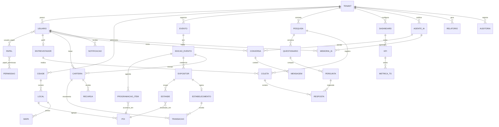
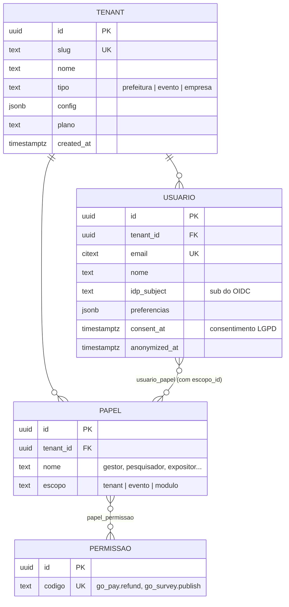
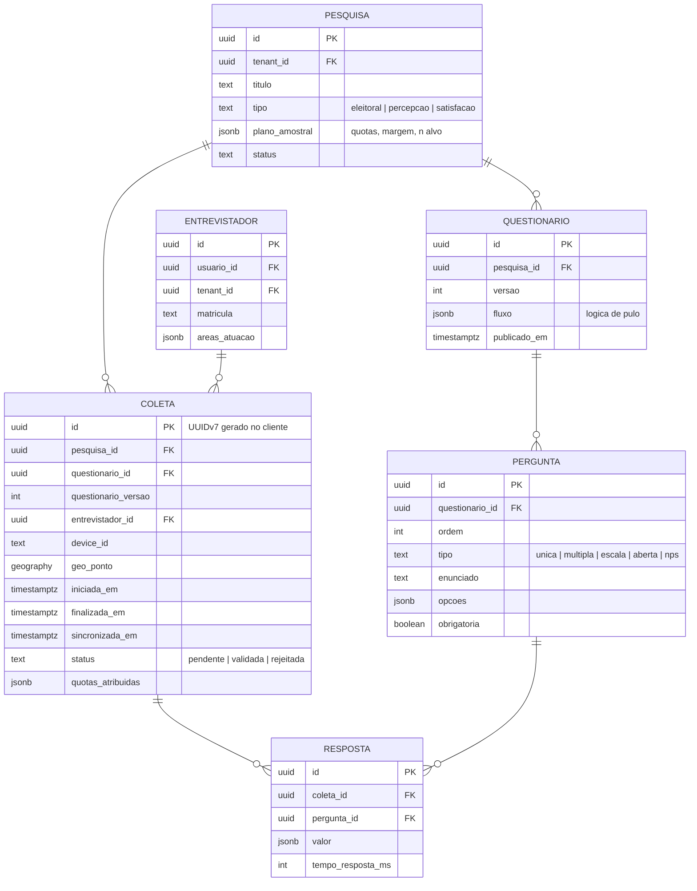
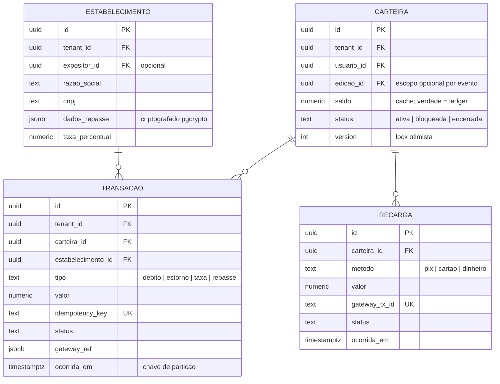

# 08 — Modelo de Dados

> **Just Go Intelligence Platform** — modelo de dados lógico e físico (PostgreSQL 16 multi-tenant com RLS, Qdrant para vetores, MinIO para objetos).
> **Documentos relacionados:** [04-arquitetura-c4.md](./04-arquitetura-c4.md) (ADR-002: RLS) · [07-arquitetura-ia-agentes.md](./07-arquitetura-ia-agentes.md)

**Convenções globais:**

- Chaves primárias `uuid` (UUIDv7 — ordenável no tempo, gerável offline pelo cliente).
- Toda tabela de tenant carrega `tenant_id uuid NOT NULL` + política RLS (exceto catálogos globais).
- Colunas padrão: `created_at timestamptz DEFAULT now()`, `updated_at timestamptz`, `deleted_at timestamptz` (soft delete onde aplicável).
- Nomes em `snake_case`, singular.

---

## 1. Diagrama Entidade-Relacionamento (visão completa)



---

## 2. Núcleo de Identidade e Multi-Tenancy



| Tabela | Campo | Tipo PostgreSQL | Chave/Índice |
|---|---|---|---|
| `tenant` | `id` | `uuid` | PK |
| | `slug` | `text` | UNIQUE |
| | `tipo` | `text CHECK (tipo IN ('prefeitura','evento','empresa'))` | idx |
| | `config` | `jsonb` | GIN (parcial) |
| `usuario` | `id` | `uuid` | PK |
| | `tenant_id` | `uuid REFERENCES tenant` | idx composto `(tenant_id, email)` UNIQUE |
| | `email` | `citext` | — |
| | `idp_subject` | `text` | UNIQUE parcial (WHERE not null) |
| | `consent_at` / `anonymized_at` | `timestamptz` | — |
| `usuario_papel` | `usuario_id, papel_id, escopo_id` | `uuid` | PK composta; idx `(usuario_id)` |

> Visitante anônimo (sem login) recebe `usuario` sintético por device apenas quando cria carteira ou conversa — minimização LGPD.

---

## 3. Domínio Cidade e Evento

| Tabela | Campos principais | Tipos | Chaves/Índices |
|---|---|---|---|
| `cidade` | `id`, `tenant_id`, `nome`, `uf`, `codigo_ibge`, `geo_centro` | `uuid, uuid, text, char(2), text, geography(Point,4326)` | PK; UNIQUE `(tenant_id, codigo_ibge)` |
| `evento` | `id`, `tenant_id`, `cidade_id`, `nome`, `categoria`, `status` | `uuid, uuid, uuid, text, text, text` | PK; idx `(tenant_id, status)` |
| `edicao_evento` | `id`, `evento_id`, `ano`, `inicio`, `fim`, `capacidade`, `config` | `uuid, uuid, int, timestamptz, timestamptz, int, jsonb` | PK; UNIQUE `(evento_id, ano)` |
| `local` | `id`, `tenant_id`, `cidade_id`, `nome`, `geo_area` | `uuid, uuid, uuid, text, geography(Polygon,4326)` | PK; GiST em `geo_area` |
| `mapa` | `id`, `local_id`, `nome`, `tiles_url`, `nivel` | `uuid, uuid, text, text, smallint` | PK |
| `poi` | `id`, `tenant_id`, `local_id`, `tipo`, `nome`, `geo_ponto`, `metadata` | `uuid, uuid, uuid, text, text, geography(Point,4326), jsonb` | PK; GiST `geo_ponto`; idx `(tenant_id, tipo)` |
| `programacao_item` | `id`, `edicao_id`, `poi_id`, `titulo`, `tipo` (show/palestra/atividade), `inicio`, `fim`, `artista`, `status`, `version` | `uuid, uuid, uuid, text, text, timestamptz, timestamptz, text, text, int` | PK; idx `(edicao_id, inicio)` |
| `expositor` | `id`, `tenant_id`, `edicao_id`, `razao_social`, `cnpj`, `categoria`, `contato` | `uuid, uuid, uuid, text, text, text, jsonb` | PK; UNIQUE `(edicao_id, cnpj)` |
| `estande` | `id`, `expositor_id`, `poi_id`, `codigo`, `area_m2` | `uuid, uuid, uuid, text, numeric(8,2)` | PK; UNIQUE `(poi_id)` |

---

## 4. Domínio Go Survey (offline-first, parceria Foccus)



**Decisões críticas:**

- `coleta.id` é UUIDv7 **gerado no dispositivo** — a chave de idempotência do sync offline (reenvio do mesmo lote não duplica).
- `coleta` referencia `questionario_versao`: edições posteriores do questionário não invalidam coletas antigas (append-only).
- **Pseudonimização:** `resposta` nunca armazena identificação do respondente; quando a pesquisa exige recontato, o identificador vive em tabela apartada `coleta_contato` com criptografia de coluna (pgcrypto) e retenção curta.
- Índices: `coleta (pesquisa_id, status)`, `coleta (entrevistador_id, iniciada_em)`, `resposta (coleta_id)`, GIN em `resposta.valor` para análise ad-hoc.
- Anti-fraude usa `tempo_resposta_ms`, `geo_ponto` e `device_id` (worker de validação).

---

## 5. Domínio Go Pay (cashless e controle financeiro municipal)



| Tabela | Campo monetário | Tipo | Observação |
|---|---|---|---|
| `transacao` / `recarga` / `carteira` | `valor`, `saldo` | `numeric(12,2)` | **Nunca** float; moeda única BRL no MVP |
| `transacao` | `idempotency_key` | `text` | UNIQUE — POS reenvia sem duplicar débito |
| `transacao` | tabela | particionada | `PARTITION BY RANGE (ocorrida_em)`, mensal |

**Regras de integridade financeira:**

1. O **ledger é a verdade**: `carteira.saldo` é cache materializado; job de conciliação recalcula `SUM(recargas) - SUM(debitos) + SUM(estornos)` e alarma divergência.
2. Débito usa lock otimista (`version`) + `CHECK (saldo >= 0)` — sem saldo negativo por corrida.
3. `transacao` e `recarga` são **imutáveis** (sem UPDATE/DELETE — revogação via evento de estorno); trigger bloqueia alteração.
4. Transparência municipal: views agregadas por estabelecimento/dia alimentam o dashboard do gestor e o export para Power BI/ERP.

---

## 6. Domínio Analytics (KPIs e séries temporais)

| Tabela | Campos | Tipos | Chaves/Índices |
|---|---|---|---|
| `dashboard` | `id`, `tenant_id`, `nome`, `layout`, `publico_alvo` | `uuid, uuid, text, jsonb, text` | PK |
| `kpi` | `id`, `tenant_id`, `dashboard_id`, `codigo`, `nome`, `definicao` (query/fórmula), `meta`, `unidade` | `uuid, uuid, uuid, text, text, jsonb, numeric, text` | PK; UNIQUE `(tenant_id, codigo)` |
| `metrica_ts` | `tenant_id`, `kpi_id`, `ts`, `dimensao` (jsonb: local, faixa etária...), `valor` | `uuid, uuid, timestamptz, jsonb, numeric` | PK `(tenant_id, kpi_id, ts, dimensao)`; BRIN em `ts` |

### Particionamento de séries temporais

```sql
CREATE TABLE metrica_ts (
    tenant_id uuid NOT NULL,
    kpi_id    uuid NOT NULL,
    ts        timestamptz NOT NULL,
    dimensao  jsonb NOT NULL DEFAULT '{}',
    valor     numeric NOT NULL
) PARTITION BY RANGE (ts);
-- Partições mensais criadas por pg_partman; índice BRIN em ts por partição.
```

- **Estratégia:** particionamento nativo por RANGE mensal via `pg_partman` (TimescaleDB é upgrade opcional se a granularidade cair para segundos — hoje minuto/hora basta).
- **Rollups:** workers agregam bruto → hora → dia; bruto retido 90 dias, agregados 5 anos (séries históricas de edições de evento e tracking eleitoral).
- Mesmo padrão de partição mensal para: `transacao`, `mensagem` (IA), `auditoria`, `notificacao`.

---

## 7. Domínio IA (agentes, conversas, memória)

| Tabela | Campos principais | Tipos | Observações |
|---|---|---|---|
| `agente_ia` | `id`, `tenant_id`, `nome`, `base_persona`, `spec` (Agent Spec JSON do GO AI Studio), `versao`, `status` | `uuid, uuid, text, text, jsonb, int, text` | UNIQUE `(tenant_id, nome, versao)` |
| `conversa` | `id`, `tenant_id`, `agente_id`, `usuario_id`, `canal`, `iniciada_em`, `encerrada_em`, `custo_total_brl` | `uuid, uuid, uuid, uuid, text, timestamptz, timestamptz, numeric(10,4)` | idx `(tenant_id, usuario_id, iniciada_em)` |
| `mensagem` | `id`, `conversa_id`, `papel` (user/assistant/tool), `conteudo`, `tool_calls`, `tokens_in`, `tokens_out`, `modelo`, `ts` | `uuid, uuid, text, text, jsonb, int, int, text, timestamptz` | particionada por `ts` (mensal) |
| `memoria_ia` | `id`, `tenant_id`, `usuario_id`, `agente_id`, `tipo` (preferencia/fato/decisao), `conteudo`, `sensibilidade`, `source_conversa_id`, `qdrant_point_id`, `expira_em` | `uuid, uuid, uuid, uuid, text, text, text, uuid, uuid, timestamptz` | espelho relacional da memória vetorial — apagável (LGPD) |

> `memoria_ia.qdrant_point_id` vincula o registro relacional ao ponto vetorial: excluir aqui **obriga** excluir no Qdrant (worker de propagação).

---

## 8. Transversais: Notificação, Relatório, Auditoria

| Tabela | Campos | Observações |
|---|---|---|
| `notificacao` | `id, tenant_id, usuario_id, canal (push/email/inapp), titulo, corpo, status, enviada_em, lida_em` | particionada mensal; retenção 12 meses |
| `relatorio` | `id, tenant_id, template_codigo, params jsonb, status, minio_object_key, gerado_por, gerado_em` | artefato binário no MinIO; metadados no PG |
| `auditoria` | `id, tenant_id, ator_id, acao, recurso_tipo, recurso_id, diff jsonb, ip inet, ts` | **append-only** (REVOKE UPDATE/DELETE); particionada mensal; retenção 5 anos (financeiro/PII) |

---

## 9. Multi-Tenant com RLS — Policy de Referência

```sql
-- 1. Toda sessão da aplicação define o tenant (dependência FastAPI):
--    SET LOCAL app.tenant_id = '<uuid do JWT>';

-- 2. Política padrão aplicada a TODAS as tabelas com tenant_id:
ALTER TABLE coleta ENABLE ROW LEVEL SECURITY;
ALTER TABLE coleta FORCE ROW LEVEL SECURITY;  -- vale até para o owner

CREATE POLICY tenant_isolation ON coleta
    USING (tenant_id = current_setting('app.tenant_id')::uuid)
    WITH CHECK (tenant_id = current_setting('app.tenant_id')::uuid);

-- 3. Papel de plataforma (analytics cross-tenant, jobs internos) — exceção explícita:
CREATE POLICY platform_read ON coleta
    FOR SELECT TO justgo_platform_analytics
    USING (true);  -- somente leitura, papel sem login direto, uso auditado

-- 4. A aplicação conecta como justgo_app (NÃO owner das tabelas).
```

**Salvaguardas:** `current_setting('app.tenant_id')` sem valor lança erro (fail-closed, sem default); teste de CI executa suíte cross-tenant contra todas as tabelas com `tenant_id`; migração que cria tabela com `tenant_id` sem policy falha no lint de migração.

---

## 10. Dados Vetoriais no Qdrant

| Coleção | Conteúdo | Payload (filtros) | Dimensão/Modelo |
|---|---|---|---|
| `kb_conhecimento` | Chunks de RAG: docs de evento, POIs, FAQs, regulamentos | `tenant_id`, `module`, `doc_id`, `chunk_ix`, `acl[]`, `valid_until` | 1024 (multilingual-e5-large) ou 3072 (text-embedding-3-large) |
| `memoria_agente` | Fatos destilados da memória de longo prazo | `tenant_id`, `usuario_id`, `agente_id`, `tipo`, `sensibilidade`, `pg_memoria_id` | idem |
| `cache_semantico` | Perguntas frequentes + respostas aprovadas (Concierge) | `tenant_id`, `edicao_id`, `ttl` | idem |

- **Isolamento:** filtro obrigatório `tenant_id` em toda busca, aplicado no código do retriever (payload index em `tenant_id` para performance).
- **Espelho relacional:** todo ponto tem contraparte em PG (`memoria_ia`, `kb_documento`) — o PG é a fonte de verdade para exclusão LGPD; o Qdrant é reconstruível.

---

## 11. Retenção e Anonimização (LGPD)

| Dado | Retenção | Ação ao expirar / a pedido do titular |
|---|---|---|
| Respostas de pesquisa (pseudonimizadas) | Indefinida (estatística) | Já sem PII; `coleta_contato` apagada em 90 dias após encerramento da pesquisa |
| Conversas de IA (`mensagem`) | 12 meses (configurável por tenant) | DROP de partição mensal (barato) + limpeza de checkpoints |
| Memória de IA | Enquanto ativo + revisão trimestral | DELETE em PG propaga a Qdrant |
| Transações Go Pay | 5 anos (fiscal) | Anonimização do titular (`usuario` → placeholder), valores preservados |
| Auditoria | 5 anos | Imutável; ator anonimizável, ação preservada |
| Direito ao esquecimento | — | Worker `lgpd_erasure`: anonimiza `usuario` (nome/email → hash), apaga memórias, conversas, contatos; **não** apaga fatos financeiros/estatísticos agregados (base legal distinta) |

---

## 12. Eventos de Domínio (RabbitMQ)

Exchange `justgo.domain` (topic). Envelope padrão: `{event_id (uuid), event_type, tenant_id, occurred_at, actor, payload, schema_version}` — publicado via Transactional Outbox (doc 04, §4.1).

| Routing key | Emitido quando | Consumidores típicos |
|---|---|---|
| `survey.responses.received` | Lote de sync offline aceito | Worker de validação/anti-fraude, Go Analytics |
| `survey.published` | Questionário publicado | Notificações a entrevistadores, invalidação de cache |
| `pay.transaction.completed` | Débito confirmado | Ledger de conciliação, Go Analytics, dashboard tempo real (WS) |
| `pay.recharge.settled` | Recarga confirmada pelo gateway | Carteira (saldo), notificação ao visitante |
| `event.schedule.changed` | Item de programação alterado | Push a visitantes, invalidação de `cache_semantico` |
| `vision.plate.read` | Go Vision lê placa em portaria | Go Access (credencial de veículo), auditoria |
| `ai.conversation.ended` | Conversa encerrada | Worker de consolidação de memória, billing de IA |
| `lgpd.erasure.requested` | Titular exerce direito | Worker `lgpd_erasure` (PG + Qdrant + MinIO) |
| `report.generation.requested` | Relatório solicitado | Worker Go Report → MinIO → notificação |

**Garantias:** at-least-once (consumidores idempotentes por `event_id`); DLQ por fila com alarme; versionamento de schema dos eventos (`schema_version`) com compatibilidade retroativa por 2 versões.

---

*Documento mantido por Just Go Smart Access. Migrações de referência em `apps/api-core/migrations/` (Alembic, uma pasta por módulo).*
