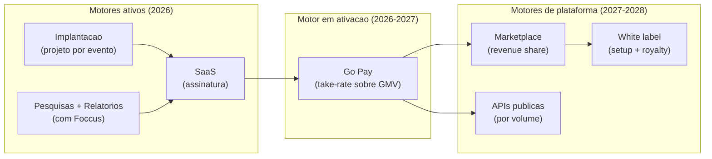

# Plano de Monetização — Just Go Intelligence Platform

**Empresa:** Just Go Smart Access | **Fundador:** Daniel Steinbruch
**Versão:** 1.0 | **Data:** Julho/2026 | **Horizonte de projeção:** jul/2026 → jun/2028 (24 meses)

> **Regra deste documento:** nenhum número sem premissa. Preços listados são tabela comercial vigente; projeções são cenários com premissas explícitas, não compromissos.

---

## Sumário

1. [Arquitetura de Receita (visão geral)](#1-arquitetura-de-receita-visão-geral)
2. [SaaS — Tiers Detalhados](#2-saas--tiers-detalhados)
3. [Receita de Implantação (Projetos)](#3-receita-de-implantação-projetos)
4. [Pesquisas e Relatórios (com Foccus)](#4-pesquisas-e-relatórios-com-foccus)
5. [Go Pay — Take-Rate sobre Cashless](#5-go-pay--take-rate-sobre-cashless)
6. [Marketplace — Revenue Share](#6-marketplace--revenue-share)
7. [APIs Públicas — Planos por Volume](#7-apis-públicas--planos-por-volume)
8. [White Label](#8-white-label)
9. [Projeção de Receita 24 Meses — 3 Cenários](#9-projeção-de-receita-24-meses--3-cenários)
10. [Métricas-Alvo](#10-métricas-alvo)
11. [Precificação para o Setor Público](#11-precificação-para-o-setor-público)

---

## 1. Arquitetura de Receita (visão geral)

**Lógica da escada:** serviços (implantação + pesquisa) geram caixa e adquirem o cliente; o SaaS converte o cliente em receita recorrente; o Go Pay escala a receita com o tamanho do evento sem esforço comercial adicional; marketplace, APIs e white label monetizam o ecossistema quando houver massa crítica (não antes).

| Linha de receita | Tipo | Margem bruta estimada* | Papel no modelo |
| --- | --- | --- | --- |
| Implantação | Serviço/projeto | 45-55% | Caixa + aquisição |
| Pesquisa + relatório | Serviço (split Foccus) | 35-45% (parte Just Go) | Credibilidade + porta de entrada |
| SaaS | Recorrente | 75-85% | Valor de empresa (ARR) |
| Go Pay | Transacional | 40-55% do take-rate líquido | Escala sem venda |
| Marketplace | Comissão | ~90% da comissão | Efeito de rede |
| APIs | Recorrente por consumo | 80%+ | Monetização do dado |
| White label | Licença | 70%+ | Expansão via terceiros |

*\*Premissa: margens estimadas com base em estruturas típicas de SaaS B2B e operações híbridas de serviço; validar com contabilidade real após 6 meses de operação.*

---

## 2. SaaS — Tiers Detalhados

### 2.1 Tabela de planos (vigente jul/2026)

| | **Starter — R$ 990/mês** | **Business — R$ 2.490/mês** | **Enterprise — R$ 4.990/mês** |
| --- | --- | --- | --- |
| **Cliente-alvo** | Município pequeno ou organizador com 1-2 eventos/ano | Município médio / organizador com calendário anual | Município grande, arenas, secretarias estaduais |
| Go Event (app do evento) | 1 evento ativo por vez | Até 4 eventos simultâneos | Ilimitado |
| Go Survey | Até 1.000 respostas/mês | Até 5.000 respostas/mês | Ilimitado + amostragem assistida |
| Go Analytics | Dashboards padrão | Dashboards + segmentações + benchmark | Analytics avançado + série histórica completa |
| Go Report | 1 relatório automático/trimestre | Relatórios ilimitados (automáticos) | Relatórios + dossiê para órgãos de controle |
| Go AI (assistente) | Consultas básicas | Agente Analista | Agentes Analista + Gestor + Concierge |
| Go Expo | — | Incluído | Incluído + relatório por expositor |
| Go Tourism | — | Incluído | Incluído + integração com observatório |
| Go Pay | Elegível (take-rate à parte) | Elegível + conciliação | Elegível + split multiconta + painel fiscal |
| Usuários administrativos | 3 | 10 | Ilimitado |
| Suporte | E-mail (48h úteis) | Prioritário (24h úteis) | Gerente de conta + SLA contratual |
| Onboarding | Autosserviço guiado | Remoto assistido | Implantação dedicada |

**Regras comerciais:**

- Contrato anual com pagamento mensal; **desconto de 15% no pagamento anual antecipado** (relevante para empenho único no setor público).
- Excedentes de volume (respostas, eventos) cobrados por pacote adicional — evita "punir" o sucesso do cliente e cria expansão natural (NRR).
- Upgrade pro-rata a qualquer momento; downgrade apenas na renovação.

### 2.2 Premissas de adoção

- Todo cliente de implantação recebe **3 meses de SaaS inclusos** (Starter ou Business conforme porte) — mecanismo de conversão da hipótese H3 do Lean Canvas.
- Mix-alvo em regime (mês 24): 50% Starter, 35% Business, 15% Enterprise → **ticket médio ponderado ~R$ 2.115/mês**.

---

## 3. Receita de Implantação (Projetos)

| Pacote | Escopo | Faixa de preço | Premissa de custo/margem |
| --- | --- | --- | --- |
| **Start** (até 5 mil visitantes) | Go Event + Go Survey configurados, treinamento remoto, operação assistida remota, relatório padrão | **R$ 18-30 mil** | ~10-15 dias-pessoa; margem bruta ~50% |
| **Professional** (até 20 mil visitantes) | Start + presença em campo, Go Expo, pesquisa multissegmento com Foccus, dossiê executivo | **R$ 45-80 mil** | ~25-35 dias-pessoa + campo; margem ~45-50% |
| **Enterprise** (grandes eventos/calendário anual) | Professional + Go Pay, integração com sistemas do cliente, múltiplos eventos, war room | **R$ 120-350 mil** | Projeto sob medida; margem-alvo ≥ 45% |

**Papel estratégico:** a implantação é o "CAC pago pelo cliente". Meta: **cada implantação Professional gera 1 assinatura Business + 1 pesquisa recorrente + candidatura a Go Pay**.

---

## 4. Pesquisas e Relatórios (com Foccus)

| Produto | Preço de referência | Split indicativo (premissa) | Entregável |
| --- | --- | --- | --- |
| Pesquisa avulsa (impacto/satisfação/perfil) | **~R$ 18 mil** | Foccus 55-60% (campo/metodologia) · Just Go 40-45% (plataforma/análise) | Base de dados + dashboards Go Analytics |
| Relatório executivo | **~R$ 15 mil** | Just Go 70% · Foccus 30% (revisão metodológica) | Dossiê auditável (impacto, satisfação, recomendações) |
| Pacote pesquisa + relatório | R$ 30-33 mil (bundle) | Conforme acima | Pacote "prestação de contas" completo |
| Tracking (3 ondas/ano) | R$ 45 mil/ano | Conforme acima | Série histórica comparável |

**Premissas:** split a formalizar em contrato com a Foccus; capacidade de campo da parceria estimada em 3-5 projetos/mês sem contratação adicional (referência: 1.647 entrevistas entregues no Canaã em um único evento).

**Escala futura (Go Research):** padronização de questionários e amostragem assistida por IA elevam a margem da Just Go por projeto sem aumentar preço — ganho de produtividade, não de repasse.

---

## 5. Go Pay — Take-Rate sobre Cashless

### 5.1 Proposta de take-rate

| Componente | Percentual sugerido | Benchmark de referência (premissa) |
| --- | --- | --- |
| Taxa total ao evento (MDR cashless) | **2,3-3,0% sobre o volume transacionado** | Operações cashless de eventos no Brasil praticam tipicamente entre 2,5% e 5% (adquirência + serviço); MDR de cartão presencial no varejo: ~1-2,5% |
| Split com instituição de pagamento parceira | 1,2-1,6 p.p. | Custo de adquirência/liquidação + risco regulatório no parceiro licenciado |
| **Take-rate líquido Just Go** | **~1,0-1,4% do GMV** | Meta conservadora ante mercado; posicionamento abaixo do teto do mercado para acelerar adoção |

> **Nota:** benchmarks acima são referências de mercado de conhecimento geral, usadas como premissa de planejamento; os percentuais finais dependem da negociação com a instituição de pagamento parceira e do volume comprometido.

### 5.2 Argumento de venda (por que o evento aceita a taxa)

1. **Para a gestão municipal:** visibilidade e controle totais da economia do evento — arrecadação, consumo por setor, horário e ponto de venda — com trilha auditável para prestação de contas aos órgãos de controle.
2. **Para o comerciante:** fim do caixa em espécie (segurança), conciliação automática, dados de venda.
3. **Para o visitante:** fila menor, recarga via Pix, saldo devolvido automaticamente.

### 5.3 Unit economics ilustrativos (premissas explícitas)

| Premissa | Valor |
| --- | --- |
| Evento de 15 mil visitantes | consumo médio R$ 55/visitante dentro do evento |
| GMV do evento | R$ 825 mil |
| Adoção cashless | 70% do consumo → R$ 577 mil transacionados |
| Take-rate líquido Just Go (1,2%) | **~R$ 6,9 mil por evento** |
| Evento grande (60 mil visitantes, mesmas premissas) | GMV cashless R$ 2,3 mi → **~R$ 27,7 mil** |

**Leitura:** o Go Pay individualmente é receita moderada por evento pequeno, mas (a) escala linearmente com o porte sem custo comercial, (b) é recorrente por edição, e (c) o dado transacional alimenta Go Analytics e GO Intelligence — valor composto além da taxa.

---

## 6. Marketplace — Revenue Share

**Ativação prevista: a partir do mês 15-18 (out/2027+), condicionada a ≥ 25 clientes ativos.**

| Item | Modelo | Referência |
| --- | --- | --- |
| Plugins/apps de terceiros (ex.: sorteio, credenciamento de imprensa, gestão de ambulantes) | Revenue share sobre venda/assinatura do plugin | **Comissão Just Go de 20-30%** (premissa: faixa praticada por marketplaces SaaS B2B; abaixo dos ~30% de app stores consumer para atrair desenvolvedores cedo) |
| Agentes criados no GO AI Studio publicados por parceiros | Revenue share idêntico a plugins | 20-30% |
| Templates de pesquisa/relatório premium | Venda avulsa com comissão | 30% |
| SDK e documentação | Gratuitos (estratégia de adoção) | R$ 0 — o SDK não é receita, é aquisição de ecossistema |

**Meta de contribuição:** marketplace ≤ 5% da receita até mês 24 (deliberado — é aposta de longo prazo, não motor de curto prazo).

---

## 7. APIs Públicas — Planos por Volume

**Ativação prevista: mês 18+, para dados agregados/anonimizados e integrações.**

| Plano | Volume incluso | Preço/mês (premissa) | Público |
| --- | --- | --- | --- |
| Dev (sandbox) | 10 mil chamadas | Gratuito | Desenvolvedores, provas de conceito |
| Integração | 100 mil chamadas | R$ 490 | Consultorias, integradores municipais |
| Dados & Insights | 500 mil chamadas + endpoints de benchmark | R$ 1.490 | Observatórios de turismo, imprensa de dados, academia |
| Enterprise API | Volume negociado + SLA | A partir de R$ 3.990 | Govtechs incumbentes, redes hoteleiras |

**Salvaguardas:** somente dados agregados e anonimizados (conformidade LGPD); dados brutos do município jamais são vendidos — pertencem ao município (princípio de produto nº 7 do Documento de Visão).

---

## 8. White Label

**Ativação prevista: mês 18-24, sob demanda qualificada.**

| Componente | Modelo | Referência (premissa) |
| --- | --- | --- |
| Setup/branding (plataforma com marca do parceiro) | Projeto único | R$ 60-150 mil conforme escopo |
| Royalty mensal | % da receita do parceiro com a plataforma ou fixo mínimo | 15-20% da receita, mínimo R$ 4.990/mês |
| Candidatos naturais | Consultorias de gestão pública regionais, operadores de eventos multiestado, govtechs que queiram módulo de eventos/turismo | — |

**Critério de aceite:** white label só com parceiro que traga ≥ 5 clientes potenciais mapeados — evita dispersão de suporte.

---

## 9. Projeção de Receita 24 Meses — 3 Cenários

### 9.1 Premissas por cenário

| Premissa | Conservador | Base | Otimista |
| --- | --- | --- | --- |
| Implantações no período (24m) | 14 (12 Start/Prof., 2 Ent.) | 30 (24 Start/Prof., 6 Ent.) | 55 (40 Start/Prof., 15 Ent.) |
| Ticket médio de implantação | R$ 38 mil | R$ 52 mil | R$ 68 mil |
| Pesquisas + relatórios vendidos (24m) | 18 pacotes | 40 pacotes | 75 pacotes |
| Ticket médio pesquisa+relatório (parte Just Go) | R$ 14 mil | R$ 15 mil | R$ 16 mil |
| Assinantes SaaS no mês 24 | 14 | 32 | 60 |
| Ticket médio SaaS (mês 24) | R$ 1.600 | R$ 2.100 | R$ 2.400 |
| Rampa SaaS | Linear a partir do mês 4 | Linear a partir do mês 3 | Acelerada a partir do mês 3 |
| Eventos com Go Pay (24m) | 4 | 14 | 30 |
| GMV cashless médio/evento | R$ 450 mil | R$ 700 mil | R$ 1,1 mi |
| Take-rate líquido | 1,0% | 1,2% | 1,3% |
| Marketplace + APIs + white label | R$ 0 | R$ 120 mil (últimos 6 meses) | R$ 420 mil |
| Churn anual SaaS | 25% | 15% | 10% |
| Contexto implícito | Ciclo B2G mais lento que o esperado; sem captação | Execução do plano com 1 contratação comercial | Captação seed no mês 9 + canal indireto ativo |

### 9.2 Receita acumulada em 24 meses (jul/2026 → jun/2028)

| Linha de receita | Conservador | Base | Otimista |
| --- | --- | --- | --- |
| Implantação | R$ 532 mil | R$ 1.560 mil | R$ 3.740 mil |
| Pesquisas + relatórios (parte Just Go) | R$ 252 mil | R$ 600 mil | R$ 1.200 mil |
| SaaS (acumulado na rampa) | R$ 246 mil | R$ 760 mil | R$ 1.640 mil |
| Go Pay | R$ 18 mil | R$ 118 mil | R$ 429 mil |
| Marketplace + APIs + WL | R$ 0 | R$ 120 mil | R$ 420 mil |
| **Total 24 meses** | **~R$ 1,05 mi** | **~R$ 3,16 mi** | **~R$ 7,43 mi** |

*Método de cálculo do SaaS: rampa linear de assinantes até o número do mês 24, ticket médio aplicado sobre a média de assinantes ativos por mês, líquido do churn premissado. Valores arredondados; planilha de suporte deve acompanhar este documento em due diligence.*

### 9.3 Fotografia no mês 24 (jun/2028)

| Indicador | Conservador | Base | Otimista |
| --- | --- | --- | --- |
| MRR (SaaS) | R$ 22 mil | R$ 67 mil | R$ 144 mil |
| ARR (SaaS) | R$ 269 mil | R$ 806 mil | R$ 1,73 mi |
| Receita anualizada total (todas as linhas, run-rate) | ~R$ 0,9 mi | ~R$ 2,4 mi | ~R$ 5,6 mi |
| Clientes ativos | 16 | 38 | 70 |

> Os números de "receita anualizada" do Documento de Visão (R$ 1,8 / 4,2 / 9,5 mi) referem-se ao potencial anualizado incluindo pipeline de implantações contratadas para a temporada seguinte; a tabela acima é run-rate estrito. Ambas as leituras devem ser apresentadas juntas ao investidor para evitar ambiguidade.

### 9.4 Sensibilidade (o que mais move o resultado)

1. **Número de implantações** — 1 implantação Professional ≈ 2,5 anos de assinatura Business em receita. Prioridade comercial absoluta.
2. **Conversão implantação→SaaS** — cada 10 p.p. de conversão adicional ≈ +R$ 75-110 mil de ARR no mês 24 (cenário base).
3. **Take-rate líquido do Go Pay** — negociação com o parceiro de pagamento tem impacto direto; 0,2 p.p. ≈ ±R$ 20 mil no período (base).

---

## 10. Métricas-Alvo

| Métrica | Definição operacional | Meta mês 12 | Meta mês 24 (base) |
| --- | --- | --- | --- |
| **MRR** | Receita recorrente mensal contratada (SaaS) | ≥ R$ 35 mil | ≥ R$ 67 mil |
| **ARR** | MRR × 12 | ≥ R$ 420 mil | ≥ R$ 800 mil |
| **CAC** | Custo total de vendas e marketing ÷ novos clientes | ≤ R$ 15 mil (B2G, absorvido pela margem da implantação) | ≤ R$ 12 mil |
| **Payback de CAC** | CAC ÷ margem mensal do cliente | Imediato quando há implantação (cliente paga o CAC); ≤ 12 meses em vendas SaaS puras | ≤ 9 meses |
| **LTV** | Margem bruta mensal média × vida média do cliente (1/churn) | ≥ R$ 55 mil | ≥ R$ 90 mil |
| **LTV/CAC** | — | ≥ 3x | ≥ 5x |
| **Churn anual (logo)** | Clientes perdidos ÷ base | ≤ 20% (risco eleitoral mapeado) | ≤ 15% |
| **NRR** | Receita da coorte ano contra ano (expansão − churn) | ≥ 95% | ≥ 110% |
| **GMV Go Pay** | Volume transacionado acumulado | ≥ R$ 1,5 mi (pilotos) | ≥ R$ 10 mi |
| **Receita por colaborador** | Receita anualizada ÷ headcount | ≥ R$ 250 mil | ≥ R$ 350 mil |

**Premissas das metas:** LTV calculado com margem bruta SaaS de 80% e vida média de 3-4 anos (churn 15-25%); CAC diluído pela estratégia "o cliente paga a aquisição" via implantação. Metas revisadas trimestralmente contra realizado.

---

## 11. Precificação para o Setor Público

A engenharia comercial B2G é parte do produto. Três vias de contratação, com estratégia de preço específica:

### 11.1 Dispensa por valor (porta de entrada)

- **O quê:** contratação direta sem licitação para valores abaixo do teto legal vigente para serviços.
- **Estratégia:** manter o **pacote de entrada (pesquisa + relatório, ~R$ 33 mil) e a implantação Start (R$ 18-30 mil)** deliberadamente dentro da faixa de dispensa — primeiro contrato em 30-90 dias, sem processo licitatório.
- **Cuidado:** não fatiar artificialmente contratos para permanecer sob o teto (vedado); estruturar objetos distintos e legítimos (pesquisa ≠ software ≠ implantação).

### 11.2 Ata de Registro de Preços (escala)

- **O quê:** o fornecedor registra preços em ata de um órgão gerenciador; outros órgãos e municípios podem aderir ("carona") sem novo processo completo.
- **Estratégia:** a partir do 5º-8º cliente, buscar **uma ata regional (consórcio de municípios ou órgão estadual de turismo)** com os pacotes Start/Professional/SaaS tabelados. Uma única ata pode destravar dezenas de adesões — é o principal candidato a inflexão de escala B2G no cenário otimista.
- **Preço em ata:** tabela cheia com desconto institucional de 5-10% — previsibilidade vale mais que margem máxima.

### 11.3 Licitação (contratos Enterprise)

- **O quê:** pregão eletrônico ou concorrência para contratos maiores (implantação Enterprise, calendário anual de eventos, plataforma da secretaria).
- **Estratégia:** participar apenas quando houver diferencial técnico defensável no termo de referência (medição de impacto + pesquisa + cashless integrados); precificar com margem-alvo ≥ 45% considerando custo do processo e prazo de pagamento.
- **Higiene competitiva:** jamais induzir direcionamento de edital; a vantagem competitiva deve estar no produto e no caso comprovado, não no processo.

### 11.4 Práticas transversais B2G

| Prática | Racional |
| --- | --- |
| Exigir nota de empenho antes de mobilizar campo | Mitiga inadimplência e atraso de pagamento |
| Faturar implantação 50% na assinatura / 50% na entrega | Fluxo de caixa em ciclo público |
| SaaS com opção de fatura anual antecipada (desconto 15%) | Compatível com execução orçamentária anual |
| Cláusula de portabilidade de dados do município | Reduz objeção de aprisionamento e é argumento perante órgãos de controle |
| Reajuste anual por índice oficial em contratos plurianuais | Padrão do setor público; protege margem |
| Calendário comercial ancorado no ciclo orçamentário (proposta até ago-set para orçamento do ano seguinte) | Vender no momento em que o recurso é planejado, não quando já acabou |

---

## Síntese Executiva

1. **Hoje o dinheiro está em implantação + pesquisa** (caixa imediato, cliente paga o CAC); **o valor da empresa está no SaaS** (ARR); **a escala silenciosa está no Go Pay** (cresce com o evento, não com o time de vendas).
2. **Cenário base: ~R$ 3,2 mi acumulados em 24 meses e MRR de ~R$ 67 mil no mês 24**, com premissas conservadoras de adoção e sem depender de marketplace/APIs.
3. **A alavanca de inflexão B2G é a ata de registro de preços** — transforma venda unitária em adesão em escala.
4. **Disciplina:** marketplace, APIs e white label só ativam com massa crítica (≥ 25 clientes); antes disso, todo foco comercial na cunha Event Intelligence.

---

*Documento elaborado pela Just Go Smart Access — julho/2026. Todos os valores projetados são cenários condicionados às premissas das seções 9.1 e 10; tabela de preços vigente sujeita a revisão comercial trimestral.*
